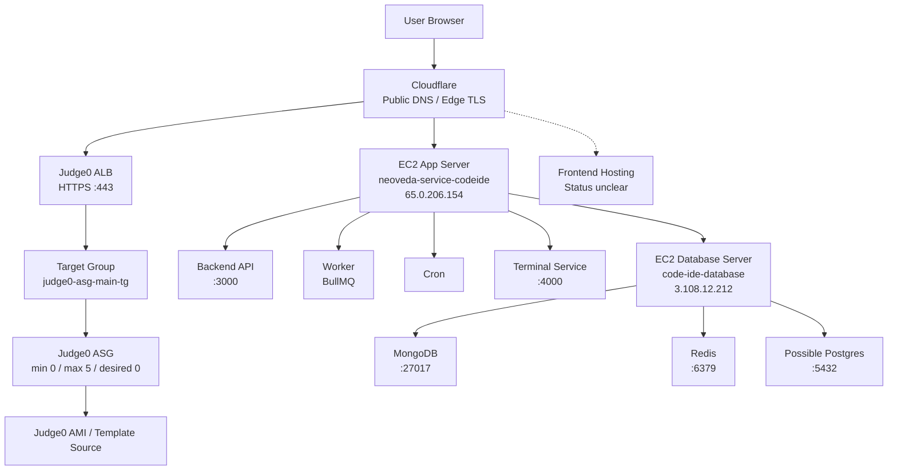
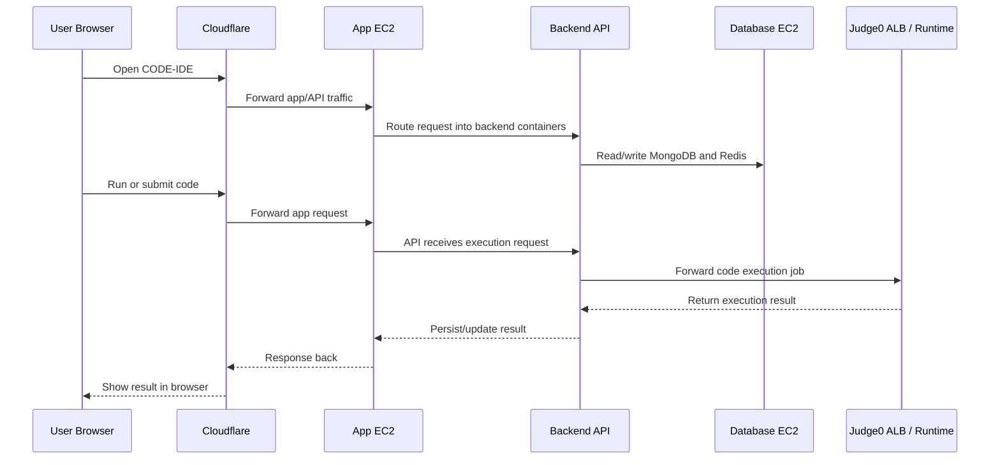

# CODE-IDE AWS Deployment Report

## 1. Purpose

This document explains the current AWS deployment of `CODE-IDE` in a project-specific and beginner-friendly way.

It is written to answer four practical questions:

1. What AWS resources exist for CODE-IDE right now?
2. What does each resource do in the context of this product?
3. What is missing or still unclear?
4. What should be fixed first?

This report is based on the current AWS inventory for `CODE-IDE` only.

It excludes unrelated resources in the same account, including:

- unrelated Amplify apps
- unrelated Knovia MySQL RDS resources

## 2. Executive Summary

The current AWS setup for `CODE-IDE` is a mostly EC2-based migration from GCP.

In simple terms, the system currently looks like this:

- one EC2 instance runs the main application services
- one EC2 instance runs the database and cache services
- one separate Judge0 execution layer exists for running user code
- Cloudflare is still the public-facing DNS and TLS entry layer
- AWS ALB + ACM are used for the Judge0 side of the traffic

This means the migration is real and substantial, but not yet fully polished as a production-grade AWS setup.

The biggest concerns are:

- database ports exposed to the internet
- SSH open to the world
- all EC2 instances currently stopped
- no visible secrets management
- no visible centralized logging
- no visible backup schedule
- frontend hosting path still unclear

## 3. AWS Scope Snapshot

### Region

- `ap-south-1` (Mumbai)

### AWS Account

- `928530207421`

### Current Runtime State

- all key EC2 instances are currently `stopped`
- Judge0 ASG is currently effectively inactive

This means the infrastructure exists, but the live state needs to be confirmed with the developer.

## 4. Resource Inventory

### 4.1 Compute Resources

| Resource Type | Name | Identifier | State | Notes |
|---|---|---|---|---|
| EC2 app server | `neoveda-service-codeide` | `i-0c7b46a82d3871d51` | `stopped` | `t2.small`, `20GB gp3`, EIP `65.0.206.154` |
| EC2 database server | `code-ide-database` | `i-0ec2f2ff1ee56ab09` | `stopped` | `t3.micro`, `30GB gp3`, EIP `3.108.12.212` |
| EC2 Judge0 template | `do-not-touch-judge0-core-ami-template` | `i-091902efeb55f3830` | `stopped` | `t2.2xlarge`, `30GB gp2`, appears to be AMI/template source |

### 4.2 Auto Scaling / Judge0 Resources

| Resource Type | Name | Identifier / Notes |
|---|---|---|
| Launch Template | `judge0-launch` | used to boot Judge0 nodes |
| AMI | `judge0-ami-image` | `ami-0a6ba03f90d31f8bc`, baked from template |
| Auto Scaling Group | `judge0-asg` | min `0`, max `5`, desired `0` |

### 4.3 Networking Resources

| Resource Type | Name / ID | Notes |
|---|---|---|
| VPC | `vpc-02d8be595f63ce95f` | default VPC |
| Internet Gateway | `igw-0a1ce656f6449dfa0` | public internet access for public subnets |
| Public Subnet | `subnet-0c8746d554009f503` | `ap-south-1a` |
| Public Subnet | `subnet-0012934fb9314260d` | `ap-south-1b` |
| Public Subnet | `subnet-00f0aff329691fc5c` | `ap-south-1c` |
| NAT Gateway | none | public IP routing used instead |

### 4.4 Load Balancing

| Resource Type | Name | Notes |
|---|---|---|
| Application Load Balancer | `judge0-alb` | internet-facing, multi-AZ |
| Target Group | `judge0-asg-main-tg` | forwards to port `2358` |
| Listener | `:80` | HTTP |
| Listener | `:443` | HTTPS with ACM certificate |

### 4.5 Security Groups

| SG Name | Attached To | Inbound Exposure |
|---|---|---|
| `launch-wizard-4` | app EC2 | `22/80/443` from anywhere |
| `launch-wizard-3` | database EC2 | `22/80/443/5432/6379/27017` from anywhere |
| `launch-wizard-6` | Judge0 nodes | `22/80/443/2358` from anywhere |

### 4.6 TLS / Certificates

| Resource Type | Name | State | Notes |
|---|---|---|---|
| ACM certificate | `velocify.in` | `ISSUED` | used on ALB `:443` |

### 4.7 Elastic IPs

| Type | IP | Status |
|---|---|---|
| Attached | `65.0.206.154` | app server |
| Attached | `3.108.12.212` | database server |
| Unattached | `52.66.39.117` | billed, not used |
| Unattached | `65.1.215.138` | billed, not used |

### 4.8 Key Pairs

| Key Pair |
|---|
| `kneoveda-db` |
| `db-access` |
| `database-secret` |
| `judge-0-key` |

## 5. What Is Not In AWS Yet

The following important AWS-native pieces are not visible for CODE-IDE yet.

### 5.1 Frontend Hosting

No visible frontend hosting resource exists for CODE-IDE in AWS such as:

- Amplify app
- S3 + CloudFront static hosting

This means the frontend is either:

1. being served from the application EC2
2. not fully migrated yet
3. hosted through another path not visible in this resource set

### 5.2 ECR

No visible Elastic Container Registry for CODE-IDE.

Practical meaning:

- images appear to be built directly on the VM using Docker Compose

### 5.3 Secrets Manager

No visible Secrets Manager usage for CODE-IDE.

Practical meaning:

- secrets likely remain in `.env` files on the EC2 machines

### 5.4 CloudWatch Logs

No visible CODE-IDE CloudWatch log groups.

Practical meaning:

- logs are likely staying on the VM/container only

### 5.5 Managed Database Services

No visible RDS or managed Redis layer for CODE-IDE.

Practical meaning:

- the system appears self-hosted on the database EC2

### 5.6 Backup Automation

No visible EBS snapshot lifecycle or backup schedule for the database host.

Practical meaning:

- data recovery posture is unclear and likely weak

## 6. Beginner-Friendly Service Explanation

This section explains each AWS service in two ways:

- what it is in general
- what it does for CODE-IDE specifically

### 6.1 EC2

**What EC2 is**

EC2 is AWS's virtual machine service. It is the equivalent of renting a server in the cloud.

**What EC2 does for CODE-IDE**

There are currently three CODE-IDE EC2 instances:

#### App server EC2

- name: `neoveda-service-codeide`
- purpose: run the main application stack

This machine most likely runs:

- backend API
- worker
- cron
- terminal websocket service

In project terms, this is the main application box.

#### Database EC2

- name: `code-ide-database`
- purpose: store and serve application data

This machine likely runs:

- MongoDB
- Redis
- maybe Postgres

In project terms, this is the persistence box.

#### Judge0 template EC2

- name: `do-not-touch-judge0-core-ami-template`
- purpose: used to prepare a reusable machine image for code execution nodes

This is probably not meant to serve live user traffic directly.

### 6.2 EBS

**What EBS is**

EBS is the disk attached to an EC2 instance. It stores the operating system, application data, and databases.

**What EBS does for CODE-IDE**

Both the app server and the database server use EBS volumes.  
The biggest concern is that no visible automated snapshot/backup process exists for the database volume.

### 6.3 AMI

**What an AMI is**

An AMI is a reusable machine image. It is like a saved snapshot of a configured server.

**What the AMI does for CODE-IDE**

The Judge0 setup appears to use a custom AMI so that new Judge0 execution nodes can be launched consistently.

### 6.4 Launch Template

**What a Launch Template is**

A Launch Template tells AWS how to create new EC2 instances automatically.

**What it does for CODE-IDE**

The Judge0 layer uses a Launch Template so AWS knows:

- which AMI to use
- what instance type to use
- what security groups to attach

### 6.5 Auto Scaling Group

**What an Auto Scaling Group is**

An Auto Scaling Group automatically creates or removes EC2 instances based on the desired count or scaling rules.

**What it does for CODE-IDE**

The Judge0 execution layer appears intended to run through an ASG:

- min `0`
- max `5`
- desired `0`

This means:

- currently there are no active Judge0 execution nodes
- execution capacity must be confirmed before calling this live

### 6.6 VPC

**What a VPC is**

A VPC is AWS's private networking boundary. It is the private network in which your AWS resources live.

**What it does for CODE-IDE**

CODE-IDE currently uses the default VPC. This is fast for initial migration but not as structured as a custom VPC design.

### 6.7 Subnets

**What subnets are**

Subnets divide the VPC into smaller network segments, usually tied to different availability zones.

**What they do for CODE-IDE**

The ALB spans multiple subnets and availability zones. That improves availability for the Judge0 side.

### 6.8 Internet Gateway

**What an Internet Gateway is**

It gives public internet access to public subnets in the VPC.

**What it does for CODE-IDE**

It allows the EC2 machines and ALB to be reachable from the public internet.

### 6.9 Elastic IP

**What an Elastic IP is**

A static public IP address in AWS.

**What it does for CODE-IDE**

Used for:

- app server stable public IP
- database server public IP

Two extra EIPs are unattached and currently waste money.

### 6.10 Security Group

**What a Security Group is**

A Security Group is a firewall around an AWS resource.

**What it does for CODE-IDE**

Security groups control who can reach:

- app VM
- database VM
- Judge0 nodes

Current problem:

- database and SSH ports are too open

### 6.11 Application Load Balancer

**What an ALB is**

An Application Load Balancer accepts web traffic and forwards it to the correct backend service.

**What it does for CODE-IDE**

The ALB is currently used for Judge0 traffic, not for the main app server.

It:

- accepts HTTPS
- terminates TLS using ACM
- forwards traffic to Judge0 target group on port `2358`

### 6.12 Target Group

**What a Target Group is**

A Target Group is the list of backend instances/services that the ALB can send traffic to.

**What it does for CODE-IDE**

The Judge0 ALB uses the target group `judge0-asg-main-tg` to forward execution requests.

### 6.13 ACM

**What ACM is**

AWS Certificate Manager manages SSL/TLS certificates.

**What it does for CODE-IDE**

The `velocify.in` certificate is used by the Judge0 ALB so traffic to the execution layer can be encrypted properly.

### 6.14 Key Pairs

**What EC2 key pairs are**

SSH credentials for logging into EC2 instances.

**What they do for CODE-IDE**

They allow developers/admins to log into the machines directly.

## 7. CODE-IDE Architecture In Plain Project Terms

The easiest way to understand this project on AWS is:

- `Cloudflare` sits in front
- `App EC2` runs the backend business logic
- `Database EC2` stores app data and queue/cache state
- `Judge0 layer` runs user-submitted code
- `Frontend hosting` is still not clearly visible in AWS

## 8. Main Architecture Diagram

## 9. Request Flow Diagram

## 10. CODE-IDE Application Responsibilities By Infrastructure Layer

### 10.1 Application EC2

This is the most important EC2 instance from the business point of view.

It likely runs Docker Compose for:

- backend API
- worker
- cron
- terminal WebSocket service

In this project, it is responsible for:

- login and auth APIs
- role/skill/assessment APIs
- assessment start and submit flows
- code submission orchestration
- certificate routes
- terminal websocket handling

### 10.2 Database EC2

This is the data layer box.

Likely responsibilities:

- MongoDB for persistent application records
- Redis for queues and caching
- maybe Postgres, though that must be confirmed

In project context, this machine likely stores:

- assessment definitions
- solutions / attempts
- evaluation state
- role-skill taxonomy
- queue/cache data

### 10.3 Judge0 Layer

This is the code execution layer.

In project context, it is the part that:

- receives candidate code
- runs it inside a safe sandbox
- returns execution results

This is important because it means CODE-IDE is becoming independent from external execution providers.

## 11. What Is Still Unclear

These are the main unresolved parts of the deployment.

### 11.1 Is The Frontend Fully Migrated?

No clear AWS frontend hosting resource exists.

Possible explanations:

- served from app EC2 using reverse proxy
- migration incomplete
- hosted elsewhere

### 11.2 Is Judge0 Actually Live?

The ASG desired count is `0`.

That suggests:

- no Judge0 nodes may currently be running
- code execution may not actually be available right now

### 11.3 Is Postgres Actually Used?

Port `5432` is open, but the project appears MongoDB + Redis centric.

This needs confirmation.

### 11.4 Is MongoDB Atlas Still In Use?

The current AWS shape suggests self-hosted MongoDB.

But it should be confirmed whether:

- Atlas is fully replaced
- or still used in parallel

## 12. Security Risks You Should Fix First

## 12.1 Database Ports Open To The Internet

Current issue:

- `27017`
- `6379`
- `5432`

are exposed publicly on the database security group.

Why this is dangerous:

- internet-wide bots scan these ports constantly
- weak or misconfigured services can be compromised quickly

Project-specific impact:

- candidate data
- assessment records
- role-skill mappings
- queue/cache state

could all be exposed or destroyed

### What should happen

These ports should only be reachable from the app server security group, not from the public internet.

## 12.2 SSH Open To The World

Current issue:

- port `22` is open publicly

Why this is dangerous:

- brute-force login attempts
- expanded admin attack surface

### What should happen

- restrict SSH to known admin IPs
- or use Session Manager

## 12.3 All EC2 Instances Are Stopped

Current issue:

- the core app and database hosts are not running

Why this matters:

- the environment may not actually be live
- this must be confirmed before any go-live assumption

## 12.4 No Visible Secrets Management

Current issue:

- likely `.env` based secrets on VMs

Why this matters:

- weak auditability
- harder rotation
- higher accidental exposure risk

## 12.5 No Visible Centralized Logs

Current issue:

- logs likely stay on the host only

Why this matters:

- debugging production problems becomes difficult
- logs can vanish with instance/container issues

## 12.6 No Visible Backup Automation

Current issue:

- no visible EBS snapshot lifecycle

Why this matters:

- one storage failure can become real data loss

## 13. Cost Risks And Waste

### Unattached Elastic IPs

These two IPs are currently wasted:

- `52.66.39.117`
- `65.1.215.138`

That means:

- they bill monthly
- they are doing no useful work

### ALB Cost

Even if instances are stopped, the ALB still costs money while active.

### EBS Cost

EBS volumes also continue billing even when instances are stopped.

## 14. What This Deployment Says About The Migration Strategy

### 14.1 This Is A Lift-And-Shift Style Backend Migration

The main application was not re-platformed into:

- ECS
- Lambda
- Amplify backend
- full managed service architecture

Instead, it appears to have been moved into EC2 with Docker Compose.

That is fast and practical for an early migration.

### 14.2 The Database Layer Was Simplified Into A Dedicated VM

Instead of using managed services, the developer appears to have chosen one EC2 database box.

That reduces migration complexity, but increases:

- security responsibility
- maintenance work
- backup responsibility
- failure risk

### 14.3 Judge0 Is An Architecture Upgrade

This is one of the best parts of the migration.

It means the platform is moving toward self-controlled execution infrastructure for code grading.

### 14.4 Frontend Migration Is The Least Clear Layer

This is the part that still needs the most clarification.

## 15. Recommended Immediate Actions

### Highest Priority

1. Restrict MongoDB / Redis / Postgres ports to internal security-group-only access
2. Restrict or replace public SSH access
3. Confirm whether the environment is intended to be live right now

### Next Priority

4. Confirm frontend hosting path
5. Confirm whether Judge0 runtime is actually active
6. Confirm whether MongoDB Atlas is fully decommissioned

### Hygiene / Maturity

7. Release unattached Elastic IPs
8. Add CloudWatch logging
9. Move secrets to Secrets Manager or SSM
10. Add backup lifecycle for database storage

## 16. Questions To Ask The Developer

These are the most valuable clarifying questions right now.

### Environment State

- Why are the app, database, and Judge0 template instances stopped?
- Is the deployment live, paused, or still under test?

### Frontend

- Is the frontend being served from the backend EC2?
- If yes, what reverse proxy is serving it?
- If not, where is the frontend actually hosted?

### Databases

- Is MongoDB Atlas fully removed from this project?
- Was all application data moved into the self-hosted MongoDB instance?
- Is Postgres really used here, or is port `5432` just left open by mistake?

### Judge0

- Is there an actual live ASG runtime for Judge0, or only the template/image setup?
- If desired count is `0`, how is code execution supposed to work right now?

### Security

- Are MongoDB and Redis authentication definitely enabled?
- Why are database ports exposed publicly?

### Backups

- What is the restore plan for MongoDB data?
- Are EBS snapshots automated anywhere outside the visible setup?

## 17. Final Assessment

The current AWS setup for CODE-IDE is:

- real
- substantial
- partially mature
- not yet cleanly production-ready based on the visible evidence

What is already good:

- app layer exists
- data layer exists
- execution layer exists
- TLS exists
- static public addressing exists

What is still weak:

- security posture
- operational visibility
- backup posture
- frontend clarity
- live-state certainty

So the most accurate conclusion is:

**AWS migration infrastructure exists, but production readiness is not yet fully validated.**

## 18. Last Updated

- Date: 2026-04-24
- Region: `ap-south-1`
- AWS Account: `928530207421`
- Scope: CODE-IDE resources only
- Inputs considered:
  - current AWS inventory summary
  - existing local AWS guide in [AWS-HOSTING-GUIDE.md](E:/Neoveda/CODE-IDE-ARYAN/aws/AWS-HOSTING-GUIDE.md)
