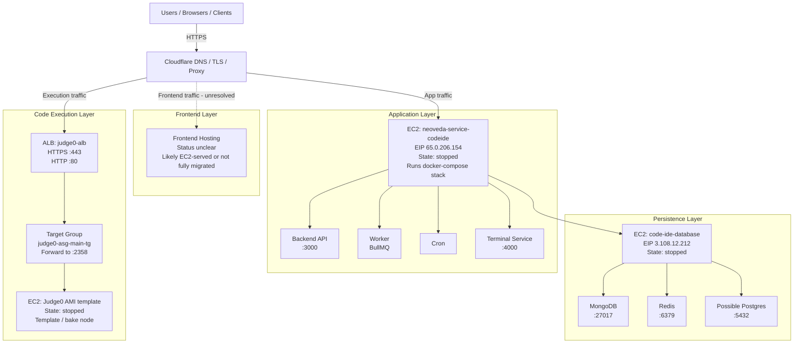
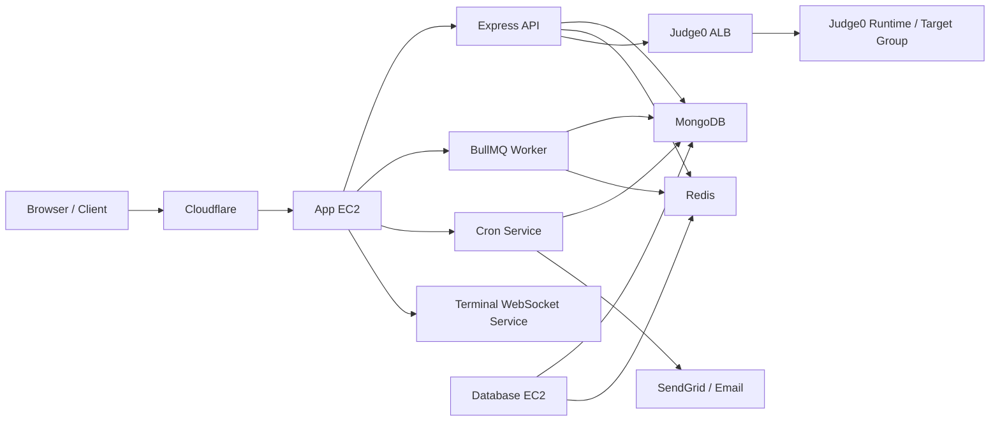

# CODE-IDE AWS Deployment Report

## Purpose

This document captures the current AWS deployment picture for `CODE-IDE` based on the resources currently present in the account.

It focuses only on `CODE-IDE` resources and excludes:

- unrelated Amplify apps in the same AWS account
- unrelated Knovia MySQL RDS resources

This report is intended to help with:

- architecture understanding
- audit and handoff
- migration review
- risk identification
- next-step planning

## Scope Summary

Current AWS region:

- `ap-south-1`

Current deployed shape:

- one EC2 instance for the main application stack
- one EC2 instance for database/cache hosting
- one Judge0 image/template EC2 instance used for execution infrastructure preparation
- one ALB for Judge0 traffic
- ACM certificate for TLS on the AWS side
- Elastic IPs for fixed addressing

Important overall status:

- all three EC2 instances are currently `stopped`
- the migration appears partially built but not confirmed as live production traffic

## Executive Summary

The current AWS setup for `CODE-IDE` is a mostly lift-and-shift infrastructure design with one notable improvement: code execution has been brought under your own control via Judge0 instead of depending only on an external execution endpoint.

The system currently appears to be organized as:

- `app server EC2`
  - backend API
  - worker
  - cron
  - terminal service
- `database EC2`
  - MongoDB
  - Redis
  - possibly Postgres
- `Judge0 execution layer`
  - ALB
  - target group
  - AMI/template instance

The architecture is workable for MVP or staging, but it has several production risks:

- databases exposed to the public internet
- SSH open to the world
- no visible secrets management
- no visible centralized logging
- no visible backup strategy
- unclear frontend hosting state

## Current AWS Resource Inventory

### Compute

| Layer | Resource | Identifier | State | Size / Notes |
|---|---|---|---|---|
| Compute | EC2 - backend app server | `neoveda-service-codeide` (`i-0c7b46a82d3871d51`) | `stopped` | `t2.small`, `20GB gp3`, EIP `65.0.206.154` |
| Compute | EC2 - database host | `code-ide-database` (`i-0ec2f2ff1ee56ab09`) | `stopped` | `t3.micro`, `30GB gp3`, EIP `3.108.12.212` |
| Compute | EC2 - Judge0 AMI template | `do-not-touch-judge0-core-ami-template` (`i-091902efeb55f3830`) | `stopped` | `t2.2xlarge`, `30GB gp2`, appears to be image/template only |

### Network

| Layer | Resource | Identifier | State | Notes |
|---|---|---|---|---|
| Network | Application Load Balancer | `judge0-alb` | `active` | internet-facing, spans 3 AZs |
| Network | Target Group | `judge0-asg-main-tg` | active attachment context | HTTP on `:2358` |
| Network | Security Group - app | `launch-wizard-4` | attached | ports `22/80/443` from anywhere |
| Network | Security Group - db | `launch-wizard-3` | attached | ports `22/80/443/5432/6379/27017` from anywhere |
| Network | Security Group - Judge0 | `launch-wizard-6` | attached | ports `22/80/443/2358` from anywhere |

### TLS

| Layer | Resource | Identifier | State | Notes |
|---|---|---|---|---|
| TLS | ACM certificate | `velocify.in` | `ISSUED` | attached to ALB `:443` |

### Access Keys / SSH Keys

| Layer | Resource | Identifier | Notes |
|---|---|---|---|
| Keys | EC2 key pairs | `kneoveda-db`, `db-access`, `database-secret`, `judge-0-key` | SSH access keys across tiers |

### Idle / Waste

| Layer | Resource | Identifier | Status | Notes |
|---|---|---|---|---|
| Idle | Unassociated Elastic IP | `52.66.39.117` | wasted | charged while unattached |
| Idle | Unassociated Elastic IP | `65.1.215.138` | wasted | charged while unattached |

## What Is Not In AWS Yet

The following parts are not visible as completed AWS-native pieces for `CODE-IDE`:

### Frontend Hosting

There is no visible AWS-native frontend hosting for `CODE-IDE`, such as:

- Amplify app for CODE-IDE
- S3 + CloudFront frontend distribution

That means one of the following is true:

1. the frontend is being served from the backend EC2
2. the frontend migration is incomplete
3. a hosting layer exists outside the currently reviewed resource set

### Container Registry

No visible `ECR` repository for CODE-IDE images.

Current implication:

- containers appear to be built directly on the VM using `docker-compose build`

### Secrets Management

No visible `Secrets Manager` usage for CODE-IDE.

Current implication:

- credentials likely still live in `.env` files on EC2 instances

### Centralized Logs

No visible `CloudWatch Logs` setup dedicated to CODE-IDE.

Current implication:

- logs likely only exist inside Docker/container or host runtime
- a VM failure may take logs with it

### Managed Database Layer

No visible `RDS` for CODE-IDE.

Current implication:

- persistence appears self-hosted on the EC2 database instance

### Backups

No visible snapshot lifecycle or backup automation for the EBS-backed data layer.

Current implication:

- storage failure risk is currently significant unless backups exist elsewhere

## High-Level Architecture Diagram

## Runtime Application Diagram

This second diagram focuses on logical application behavior rather than raw infrastructure.

## What Each Service Does In CODE-IDE Context

### 1. `neoveda-service-codeide` EC2

Role:

- main application server
- equivalent to the old GCP compute node for the backend stack

Expected runtime responsibilities:

- Express API
- BullMQ worker
- cron runner
- terminal WebSocket service

Mapped to repo structure:

- backend API:
  - `assesment-platform-api/index.js`
- worker:
  - `assesment-platform-api/workers/worker.js`
- cron:
  - `assesment-platform-api/cron/index.js`
- terminal:
  - `assessment-platform-cloud-service/`

This instance is the primary business logic node for:

- authentication
- assessments
- coding submissions
- queue-driven evaluation
- PDF certificate delivery
- Linux terminal websocket flow

### 2. `code-ide-database` EC2

Role:

- self-hosted persistence and caching layer

Most likely services based on open ports:

- MongoDB on `27017`
- Redis on `6379`
- possible Postgres on `5432`

This appears to be a design decision to self-host stateful services on a dedicated VM instead of using:

- MongoDB Atlas
- ElastiCache
- RDS

In product terms, this instance likely supports:

- assessment definitions
- assessment solutions / attempts
- role-skill taxonomy
- queue/cache state
- evaluation state

### 3. `judge0-alb` + `judge0-asg-main-tg` + Judge0 template instance

Role:

- code execution infrastructure for submitted programs

Judge0 purpose in CODE-IDE:

- sandboxed execution of candidate code
- support for languages like C, C++, Python, Java
- removal of external dependency on a third-party execution service

Why this matters:

- this is not only a migration artifact
- it is also an architecture upgrade
- it brings code execution under your own infrastructure control

ALB responsibility:

- terminate HTTPS with ACM
- forward to Judge0 execution port `2358`

Target group responsibility:

- represent the actual runtime pool for Judge0 execution nodes

Template instance responsibility:

- appears to be an AMI/image builder
- likely not intended to be the actual runtime node

Inference:

- the name `judge0-asg-main-tg` strongly suggests an intended Auto Scaling Group-backed Judge0 runtime design
- that should be confirmed by the developer

### 4. ACM Certificate `velocify.in`

Role:

- TLS termination on the AWS side of the request path

Likely usage:

- Cloudflare to AWS origin encryption
- ALB HTTPS listener support

### 5. Elastic IPs

Role:

- static public addressing for infrastructure endpoints

Used EIPs:

- app server public address
- database server public address

Unattached EIPs:

- billing waste unless intentionally reserved for upcoming use

### 6. EC2 Key Pairs

Role:

- SSH access for operational login

This is normal, but ideally production access should move toward:

- AWS Systems Manager Session Manager
- reduced or eliminated public SSH exposure

## What The Deployment Probably Looks Like At Runtime

Based on the repos and infrastructure together, the likely intended runtime is:

### App EC2

Runs Docker Compose with:

- backend API on `3000`
- worker
- cron
- terminal service on `4000`

### Database EC2

Runs:

- MongoDB
- Redis
- maybe Postgres

### Judge0 Path

Receives execution traffic through:

- ALB `:443`
- forwards to port `2358`
- runtime Judge0 nodes process submissions

### Frontend

Current status is unresolved.

There are 3 realistic possibilities:

1. served from the backend EC2 through Nginx or reverse proxy
2. not migrated yet
3. served through a hosting path not captured in the current review

## Security Review - Current Critical Issues

## 1. Databases Open To The Internet

This is the most serious issue in the current layout.

The database security group exposes:

- `27017` MongoDB
- `6379` Redis
- `5432` Postgres

to `0.0.0.0/0`

That means:

- anyone on the internet can attempt to connect
- these ports are continuously scanned by bots
- compromise risk is high if auth is weak or misconfigured

### Required action

- lock these ports to the app server security group only
- remove public internet access for database protocols
- verify:
  - MongoDB auth enabled
  - Redis password/auth enabled
  - Postgres credentials hardened if present

## 2. SSH Open To The World

Current state:

- port `22` appears open publicly on multiple instances

Risk:

- brute-force attempts
- credential attack surface
- unnecessary public management exposure

### Required action

- restrict `22` to office/admin IP ranges
- or replace with Session Manager access

## 3. Instances Are Stopped

Current state:

- app server: stopped
- database server: stopped
- Judge0 template instance: stopped

This means one of the following:

- migration is not live
- environment is intentionally parked
- developer shut down the environment after testing

### Required action

- confirm intended state with the developer immediately

## 4. Unassociated Elastic IP Waste

Current state:

- `52.66.39.117`
- `65.1.215.138`

are unattached and therefore bill without doing work.

### Required action

- release if not reserved intentionally

## 5. No Visible Secrets Management

Current state:

- no visible Secrets Manager usage
- likely `.env`-driven credentials on VMs

Risk:

- secret sprawl
- weak auditability
- higher operational risk during rotation

### Required action

- move runtime secrets to Secrets Manager or SSM Parameter Store

Typical candidates:

- `MONGODB_URI`
- `REDIS_PASSWORD`
- `SENDGRID_KEY`
- JWT secrets

## 6. No Visible Centralized Logs

Current state:

- no visible CloudWatch Logs setup for CODE-IDE

Risk:

- logs may disappear with container/VM failure
- difficult production debugging
- weak operational observability

### Required action

- ship Docker/app logs to CloudWatch

## 7. No Visible Backup Strategy

Current state:

- no obvious snapshot lifecycle for database EBS volume

Risk:

- data loss on disk failure or operator error

### Required action

- define and attach EBS snapshot lifecycle policy
- confirm restore path

## 8. Frontend Migration Is Still Unclear

Current state:

- no AWS-native frontend hosting found

Risk:

- partial migration
- hidden dependency on EC2 reverse proxy
- operational uncertainty

### Required action

- confirm exact frontend hosting path

## Operational Gaps

These are not necessarily immediate security incidents, but they are maturity gaps.

### 1. No ECR

Implication:

- images are built on VM
- weaker CI/CD hygiene
- more snowflake-server risk

### 2. No CloudWatch Logs

Implication:

- harder debugging and audit

### 3. No Secrets Manager

Implication:

- `.env` files likely remain operational dependency

### 4. No Managed Datastore

Implication:

- single database EC2 becomes a key operational dependency and risk point

### 5. No Visible Automated Backups

Implication:

- production recovery posture is weak until proven otherwise

## What This Means In Architectural Terms

The current CODE-IDE AWS deployment is best described as:

### A. Lift-and-shift for the main application

The backend stack appears to have been moved into EC2 with Docker Compose rather than re-architected to:

- ECS
- EKS
- Lambda
- managed service patterns

This is common for speed and is acceptable for a first migration stage.

### B. Self-hosted persistence

The developer appears to have consolidated data services onto a dedicated EC2 VM rather than using managed database services.

This reduces initial migration complexity but increases:

- security burden
- backup burden
- maintenance burden

### C. Improved execution independence

Judge0 is the strongest architectural improvement in this setup.

It likely removes dependence on an external grading platform and gives the product:

- infrastructure control
- more execution reliability if managed correctly
- future scaling options

### D. Frontend hosting remains the least certain layer

That uncertainty needs to be closed before calling the migration complete.

## Suggested Immediate Actions

These actions are the highest priority based on current risk.

### Priority 1 - Security

1. Restrict MongoDB / Redis / Postgres access to internal app security group only
2. Restrict SSH access or move to Session Manager
3. Confirm database authentication is strong and enabled

### Priority 2 - State Validation

4. Confirm whether the environment is intended to be live
5. Confirm frontend hosting path
6. Confirm whether MongoDB Atlas is still in use or fully replaced

### Priority 3 - Hygiene

7. Release unattached Elastic IPs
8. Add CloudWatch logging
9. Move secrets to Secrets Manager or SSM
10. Set up EBS snapshot lifecycle for database volume

### Priority 4 - Architecture Clarification

11. Confirm whether an Auto Scaling Group exists for Judge0 runtime
12. Confirm whether the template instance is only for AMI baking

## Suggested Questions For The Developer

These are the most important follow-up questions to close architecture uncertainty.

### Live State

- Why are all three instances stopped?
- Is this intended production, staging, or paused migration state?

### Frontend

- Is the frontend being served from the backend VM?
- If yes, where is the reverse proxy config?
- If not, what is the actual hosting path?

### Databases

- Was MongoDB Atlas fully decommissioned?
- Was all data migrated into self-hosted MongoDB on `code-ide-database`?
- Is Postgres actually being used or is `5432` just unnecessarily open?

### Security

- Are MongoDB and Redis authentication enabled and strong?
- Why are database ports open to the world?

### Judge0

- Is there an Auto Scaling Group behind `judge0-asg-main-tg`?
- Or is the template AMI node the only execution node currently?

### Backups

- What is the backup and restore plan for MongoDB data?
- Are EBS snapshots automated?

## Recommended Future-State Direction

If the platform continues beyond MVP/staging, the cleaner AWS target would usually be:

- frontend on Amplify or S3 + CloudFront
- app workloads on ECS/Fargate or structured EC2 deployment
- secrets in Secrets Manager
- logs in CloudWatch
- database access private only
- managed Redis / managed database where feasible
- defined backup policy

This is not required to understand the current deployment, but it clarifies where the current design is immature.

## Final Assessment

The AWS build is real and meaningful, not just a sketch. The core layers for CODE-IDE are present:

- application compute
- database/cache host
- code execution layer
- TLS on AWS side
- static public addressing

However, it is not yet a clean production-grade deployment in its current observed state because:

- the instances are stopped
- database ports are exposed publicly
- frontend hosting is unclear
- secrets/logging/backups are not visibly matured

So the correct interpretation is:

- **migration infrastructure exists**
- **deployment completeness and production readiness are not yet confirmed**

## Last Updated

- Date: 2026-04-24
- Scope: CODE-IDE AWS resources only
- Exclusions:
  - unrelated Amplify apps
  - unrelated Knovia MySQL RDS resources
