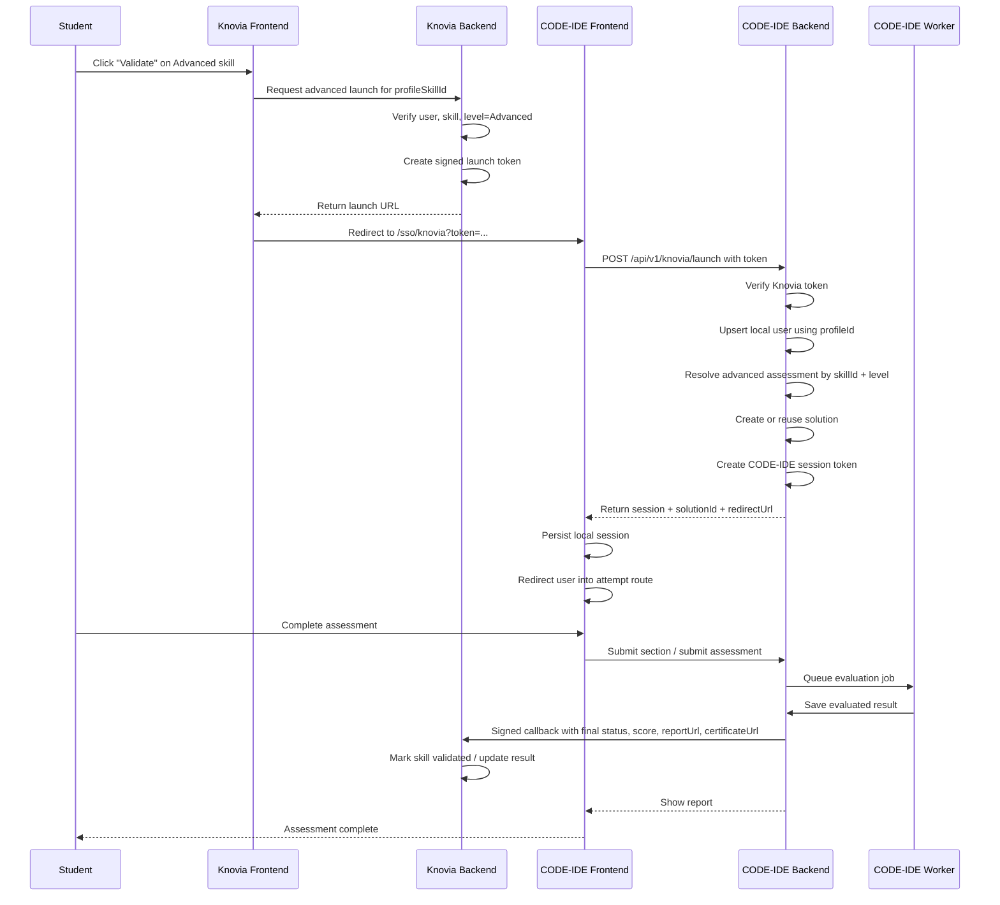
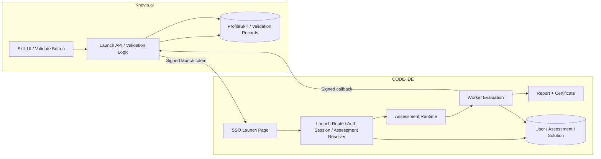
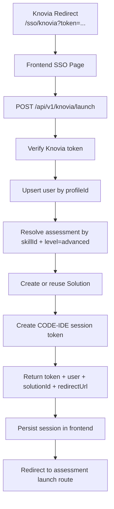

# Knovia.ai to CODE-IDE Advanced Assessment Integration Plan

## Purpose

This document explains how to integrate `knovia.ai` with `CODE-IDE` so that:

- `Beginner` and `Intermediate` skill assessments remain inside Knovia as MCQ-based assessments
- `Advanced` skill assessments are launched in `CODE-IDE`
- the student reaches `CODE-IDE` through SSO
- `CODE-IDE` sends the final result back to Knovia

This document is written for the developer who will implement the integration.

It is based on:

- the scanned `Knovia.ai` integration points
- the current `code-ide-ui` repo
- the current `codeide-backend-services` repo

## Goal

When a student clicks `Validate` for an `Advanced` skill level in Knovia:

1. Knovia should create a signed launch token
2. the student should be redirected to `lab.knovia.ai`
3. CODE-IDE should verify the token
4. CODE-IDE should create or reuse the local user using `profileId`
5. CODE-IDE should resolve the correct `advanced` assessment for the skill
6. CODE-IDE should launch the student directly into the assessment
7. once the assessment is completed and evaluated, CODE-IDE should call back to Knovia
8. Knovia should update the skill validation status and store report/certificate links

---

## Shared Cross-Platform Identity

The main shared identity field between the two platforms is:

- `profileId`

This field must become the primary cross-platform key for launch, result sync, and validation updates.

Additional shared fields that should travel with the launch:

- `profileId`
- `userId` from Knovia if needed for traceability
- `name`
- `email`
- `profileSkillId`
- `skillId`
- `skillName`
- `level = Advanced`
- `attemptId`
- `callbackUrl`
- `returnUrl`

---

## Current State

## Knovia.ai Current State

From the repo scan:

- skill levels exist and include:
  - `Beginner`
  - `Intermediate`
  - `Advanced`
- current MCQ assessment flow is internal to Knovia
- advanced is currently still treated as an internal level unless guarded
- `Validate` button exists already
- `profileId` already exists in Knovia auth and assessment-related data flow
- Knovia already has examples of:
  - signed flows
  - callbacks
  - webhook-like integrations

This means Knovia is already in a good position to act as:

- the SSO launch issuer
- the advanced skill source-of-truth
- the final result receiver

## CODE-IDE Current State

From the CODE-IDE repo scan:

- frontend auth is local email/password based
- assessment launch currently depends on:
  - `assessmentId`
  - `userId`
- there is no current SSO launch route
- there is no current `profileId` in the CODE-IDE codebase
- assessment model does not currently include proficiency level
- solution model does not currently store external-source launch metadata
- evaluation exists and report/certificate URLs already exist
- callback/webhook handling for external systems does not exist yet

This means CODE-IDE already has:

- the assessment engine
- the coding execution flow
- the evaluation flow
- the report/certificate flow

But it does **not** yet have:

- Knovia SSO launch support
- external-attempt mapping
- post-evaluation callback support

---

## Target Integration Model

## High-Level Explanation

Knovia remains the primary platform where the user sees skills and clicks `Validate`.

CODE-IDE becomes the execution lab for `Advanced` validation only.

So the ownership split becomes:

### Knovia owns

- skill listing
- proficiency selection
- decision to launch advanced validation
- launch token generation
- final skill validation record

### CODE-IDE owns

- SSO token verification
- local user session creation
- assessment launch
- assessment execution
- evaluation
- report and certificate generation
- callback back to Knovia

---

## End-to-End Flow Diagram



---

## System Architecture Diagram



---

## Launch Contract

Knovia should redirect the browser to:

```text
https://lab.knovia.ai/sso/knovia?token=<short_lived_knovia_jwt>
```

### Recommended token claims

```json
{
  "iss": "knovia",
  "aud": "code-ide",
  "jti": "uuid",
  "profileId": 123,
  "userId": 45,
  "email": "student@example.com",
  "name": "Student Name",
  "profileSkillId": 999,
  "skillId": 12,
  "skillName": "JavaScript",
  "level": "Advanced",
  "attemptId": "uuid",
  "callbackUrl": "https://api.knovia.ai/api/skillAssessment/code-ide/callback",
  "returnUrl": "https://knovia.ai/my-profile?assessment=code-ide",
  "exp": 1760000000
}
```

### Why this token must be signed

The token must be signed because CODE-IDE must trust:

- user identity
- skill identity
- advanced-level launch authority
- callback target

The browser should **not** be trusted to pass these fields as plain query params without signature verification.

---

## Callback Contract

After evaluation, CODE-IDE should send a signed server-to-server callback to Knovia.

### Recommended callback payload

```json
{
  "attemptId": "knovia-attempt-id",
  "codeIdeAttemptId": "solutionId",
  "profileId": 123,
  "profileSkillId": 456,
  "skillId": 789,
  "level": "Advanced",
  "status": "completed",
  "score": 8,
  "maxScore": 10,
  "passed": true,
  "verified": true,
  "reportUrl": "https://lab.knovia.ai/assessment/preview/<solutionId>",
  "certificateUrl": "https://api.lab.knovia.ai/api/v1/assesments/certificate/<solutionId>",
  "completedAt": "2026-04-25T10:00:00Z"
}
```

### Callback rules

- it must be signed
- it must be idempotent
- it must include the original launch identity fields
- it should only be sent once evaluation is actually complete

---

## Knovia.ai Changes Required

This section explains what must change in Knovia to support the integration.

## 1. Frontend Validate Flow

### Files already identified in Knovia

- `ProfileSkillList/index.tsx`
- `SkillManagement/index.tsx`
- `skillAssessment.service.ts`
- `skillAssessment.types.ts`

### Required change

Today, Knovia uses the validate flow to open MCQ assessment flow.

It must change so that:

- `Beginner` and `Intermediate` continue using existing MCQ flow
- `Advanced` uses a new CODE-IDE launch API instead

### New frontend behavior

If `skill.level === "Advanced"`:

1. call Knovia backend launch endpoint
2. get launch URL from backend
3. redirect browser to CODE-IDE

## 2. Backend Launch API

### Files already identified in Knovia

- `assessmentRoute.js`
- `assessmentController.js`
- `sectionSchemas.js`
- `jwtUtils.js`

### Required change

Add a new backend route for advanced launch, for example:

- `POST /api/skillAssessment/code-ide/launch`

Responsibilities:

- authenticate user
- verify the selected skill belongs to the user
- verify the selected level is `Advanced`
- create launch token
- create `attemptId`
- return redirect URL

## 3. Callback Receiver

### Required change

Add a new backend callback route, for example:

- `POST /api/skillAssessment/code-ide/callback`

Responsibilities:

- verify callback signature
- verify `attemptId`, `profileId`, `profileSkillId`, `skillId`, `level`
- ensure callback is idempotent
- update validation state
- store report and certificate URLs

## 4. Data Layer Changes In Knovia

### Required change

Current MCQ `Assessment` and `Answer` storage is not the right place for external coding assessments.

Create a separate external-attempt model, for example:

- `CodeIdeAssessmentAttempt`

Recommended fields:

- `profileId`
- `profileSkillId`
- `skillId`
- `level`
- `attemptId`
- `status`
- `score`
- `maxScore`
- `passed`
- `verified`
- `reportUrl`
- `certificateUrl`
- `codeIdeAttemptId`
- timestamps

## 5. Validation State Update

On successful callback, Knovia should:

- update the relevant `ProfileSkill`
- set advanced validation to complete
- mark the right section dirty/recomputed if needed

---

## CODE-IDE Changes Required

This section explains what must change in CODE-IDE.

## 1. Backend Route Mount

### Current file

- [index.js](E:/Neoveda/CODE-IDE-ARYAN/codeide-backend-services/assesment-platform-api/index.js)

### Required change

Add a new router mount:

- `/api/v1/knovia`

This route group should contain:

- `POST /launch`
- internal helpers if needed
- optional callback-status utilities

## 2. Backend SSO Launch Service

### New files recommended

- `assesment-platform-api/routes/knovia.routes.js`
- `assesment-platform-api/controllers/knovia.controller.js`
- `assesment-platform-api/services/knoviaSso.service.js`

### Responsibilities

- verify Knovia launch token
- validate token claims
- upsert CODE-IDE user using `profileId`
- resolve advanced assessment by `skillId + level`
- create or reuse `Solution`
- create CODE-IDE session token
- return redirect payload to frontend

## 3. Auth Session Support

### Current file

- [auth.service.js](E:/Neoveda/CODE-IDE-ARYAN/codeide-backend-services/assesment-platform-api/services/auth/auth.service.js)

### Required change

Add a helper that can create a local session for an already-trusted SSO user.

Recommended addition:

- `createSessionForUser(user)`

This should:

- sign the same CODE-IDE JWT used by normal login
- return the sanitized user object

## 4. Config Changes

### Current file

- [config.js](E:/Neoveda/CODE-IDE-ARYAN/codeide-backend-services/config/config.js)

### Required change

Add env-based config for integration:

- `KNOVIA_SSO_SECRET`
- `CODE_IDE_CALLBACK_SECRET`
- `CODE_IDE_FRONTEND_URL`
- `KNOVIA_CALLBACK_AUDIENCE`

Also move hardcoded JWT secrets into env.

## 5. User Model Changes

### Current file

- [User.js](E:/Neoveda/CODE-IDE-ARYAN/codeide-backend-services/assesment-platform-api/models/User.js)

### Required change

Add:

- `profileId`
- `authSource`

Recommended:

- `profileId` should be indexed and unique for Knovia users
- `authSource` can help distinguish:
  - `local`
  - `knovia`

## 6. Assessment Model Changes

### Current file

- [Assesment.js](E:/Neoveda/CODE-IDE-ARYAN/codeide-backend-services/assesment-platform-api/models/Assesment.js)

### Required change

Add:

- `level`

Reason:

Current assessments only have `skillId`, which is not enough to reliably resolve:

- beginner assessment
- intermediate assessment
- advanced assessment

Since this integration is specifically for `Advanced`, assessment lookup must be unambiguous.

Recommended query shape:

- `{ skillId, level: "advanced" }`

## 7. Solution Model Changes

### Current file

- [Solution.js](E:/Neoveda/CODE-IDE-ARYAN/codeide-backend-services/assesment-platform-api/models/Solution.js)

### Required change

Add launch and callback metadata:

- `externalSource`
- `externalAttemptId`
- `profileId`
- `profileSkillId`
- `skillId`
- `level`
- `callbackUrl`
- `returnUrl`
- `callbackStatus`
- `callbackSentAt`
- `callbackError`

Also:

- fix the existing wrong index using `assesmentId`
- add unique idempotency index for:
  - `{ externalSource, externalAttemptId }`

## 8. Frontend SSO Route

### New file recommended

- `code-ide-ui/app/sso/knovia/page.tsx`

### Responsibilities

This page should:

1. read `token` from URL
2. call backend `POST /api/v1/knovia/launch`
3. receive:
   - CODE-IDE token
   - local user
   - solutionId
   - redirectUrl
4. store session locally
5. redirect student into attempt flow

## 9. Frontend Auth Session Bootstrap

### Current file

- [AuthContext.tsx](E:/Neoveda/CODE-IDE-ARYAN/code-ide-ui/context/AuthContext.tsx)

### Required change

Expose a helper to bootstrap a session from a trusted backend response.

Recommended addition:

- `bootstrapSession(token, user)`

This should reuse the same storage/session logic already used in normal login.

## 10. Attempt Entry Improvement

### Current file

- [AssesmentEntry.tsx](E:/Neoveda/CODE-IDE-ARYAN/code-ide-ui/components/pages/AssesmentEntry.tsx)

### Current limitation

It expects:

- `assessmentId`
- `userId`

via query params.

### Recommended change

Prefer an internal launch path by `solutionId`, for example:

- `/assessment/launch/[solutionId]`

Why this is better:

- SSO launch is really about a specific external attempt
- `solutionId` is the real local attempt identity
- it reduces coupling to raw query params

## 11. Callback Trigger After Evaluation

### Current file

- [evaluator.js](E:/Neoveda/CODE-IDE-ARYAN/codeide-backend-services/assesment-platform-api/workers/evaluator.js)

### Required change

After successful evaluation save:

- if `externalSource === "knovia"`
- and callback not already sent
- send signed callback to Knovia

This is the correct hook because:

- score is finalized here
- `isEvaluated` is finalized here

## 12. Report And Certificate Links

### Existing reusable files

- [certificateController.js](E:/Neoveda/CODE-IDE-ARYAN/codeide-backend-services/assesment-platform-api/controllers/certificateController.js)
- [sendMail.js](E:/Neoveda/CODE-IDE-ARYAN/codeide-backend-services/assesment-platform-api/cron/sendMail.js)
- [AssesmentPreview.tsx](E:/Neoveda/CODE-IDE-ARYAN/code-ide-ui/components/pages/AssesmentPreview.tsx)

### Required usage

Use existing URL patterns for:

- `reportUrl`
- `certificateUrl`

These should be included in callback payload to Knovia.

---

## CODE-IDE Launch Flow Diagram



---

## Recommended CODE-IDE Launch API

### Request

```http
POST /api/v1/knovia/launch
Content-Type: application/json
```

```json
{
  "token": "<knoviaLaunchJwt>"
}
```

### Response

```json
{
  "success": true,
  "token": "codeIdeSessionJwt",
  "user": {
    "_id": "...",
    "userId": "knovia_123",
    "profileId": 123,
    "email": "student@example.com"
  },
  "solutionId": "...",
  "assessmentId": "...",
  "redirectUrl": "/assessment/launch/<solutionId>"
}
```

---

## Recommended CODE-IDE Callback Strategy

Use a signed callback approach similar in security level to a payment webhook, not a weak unsigned callback.

### Rules

- callback must be signed
- callback must be retriable
- callback must be idempotent
- callback should only happen after evaluation is done

### Idempotency key

Use one or both:

- `externalAttemptId`
- `codeIdeAttemptId`

### Validation before sending or accepting result

CODE-IDE and Knovia should both ensure:

- `profileId` matches launch record
- `profileSkillId` matches launch record
- `skillId` matches launch record
- `level` is still `Advanced`

---

## Main Risks / Blockers

## 1. Worker Does Not Await Evaluator

### Current file

- [worker.js](E:/Neoveda/CODE-IDE-ARYAN/codeide-backend-services/assesment-platform-api/workers/worker.js)

### Risk

Queue completion does not strictly mean evaluation and callback are complete.

### Required fix

- `await examEvaluator(job)`

## 2. Authorization Is Not Implemented Properly

### Current file

- [isAllowed.js](E:/Neoveda/CODE-IDE-ARYAN/codeide-backend-services/assesment-platform-api/middlewares/isAllowed.js)

### Risk

Real access control is weak right now.

## 3. Solution Ownership Checks Need Hardening

### Current issue

- solution fetch route is not sufficiently ownership-checked
- certificate route is public by `solutionId`

### Risk

Once reports become shared back to Knovia and potentially clients, this becomes more sensitive.

## 4. Assessment Level Is Missing

### Current issue

Assessment records do not currently have a `level`.

### Risk

Advanced assessment resolution by `skillId + level` is unreliable until schema/data are updated.

## 5. `profileId` Does Not Exist In CODE-IDE Yet

### Current issue

The current CODE-IDE codebase is still local-user oriented.

### Risk

Without `profileId`, cross-platform identity becomes brittle and hard to reconcile.

---

## Recommended Implementation Order

Do the work in this order.

### Phase 1 - Data And Auth Foundations

1. add `profileId` and `authSource` to user model
2. add `level` to assessment model
3. add external metadata to solution model
4. move secrets/config to env
5. add session signer helper for SSO-created users

### Phase 2 - Launch Flow

6. create backend Knovia launch route
7. create backend Knovia SSO service
8. create frontend `/sso/knovia` page
9. add frontend `bootstrapSession()` helper
10. redirect into internal assessment launch route

### Phase 3 - Callback Flow

11. add callback sender after evaluation
12. send report and certificate URLs
13. add callback status persistence
14. make callback idempotent

### Phase 4 - Hardening

15. fix worker await issue
16. fix ownership checks on solution/report routes
17. harden certificate/report access strategy
18. implement real authorization where needed

---

## Acceptance Criteria

The integration should be considered complete only when all of the following work:

### Launch

- advanced skill click in Knovia opens CODE-IDE
- no manual login is required in CODE-IDE
- user is linked by `profileId`
- correct advanced assessment is resolved automatically

### Attempt

- student lands directly in the intended assessment
- assessment state and submission work normally

### Result Sync

- evaluation completes
- Knovia receives callback
- Knovia updates validation status correctly
- report and certificate links are stored

### Security

- launch token is verified
- callback is signed
- callback is idempotent
- assessment resolution is not guessable or spoofable by plain query editing

---

## Developer Checklist

- [ ] Add `profileId` support to CODE-IDE user model
- [ ] Add `level` to CODE-IDE assessment model
- [ ] Add external attempt metadata to solution model
- [ ] Add Knovia SSO config env vars
- [ ] Create backend `POST /api/v1/knovia/launch`
- [ ] Create frontend `/sso/knovia` page
- [ ] Add auth bootstrap helper in frontend
- [ ] Add internal attempt launch by `solutionId`
- [ ] Add callback sender after evaluation
- [ ] Reuse report and certificate URLs in callback payload
- [ ] Make callback idempotent
- [ ] Fix worker async issue
- [ ] Harden ownership checks

---

## Final Summary

This integration should be implemented as:

- **Knovia = launch authority + final validation owner**
- **CODE-IDE = advanced assessment execution and evaluation engine**

The cleanest design is:

- signed launch token from Knovia
- SSO launch route in CODE-IDE
- `profileId` as shared identity
- assessment resolution by `skillId + level=advanced`
- callback from CODE-IDE only after evaluation completes

That approach fits the current codebases with manageable changes and avoids forcing either platform into a full auth redesign.

## Last Updated

- Date: 2026-04-26
- Based on current Knovia repo scan and current `CODE-IDE` repos in `E:/Neoveda/CODE-IDE-ARYAN`
