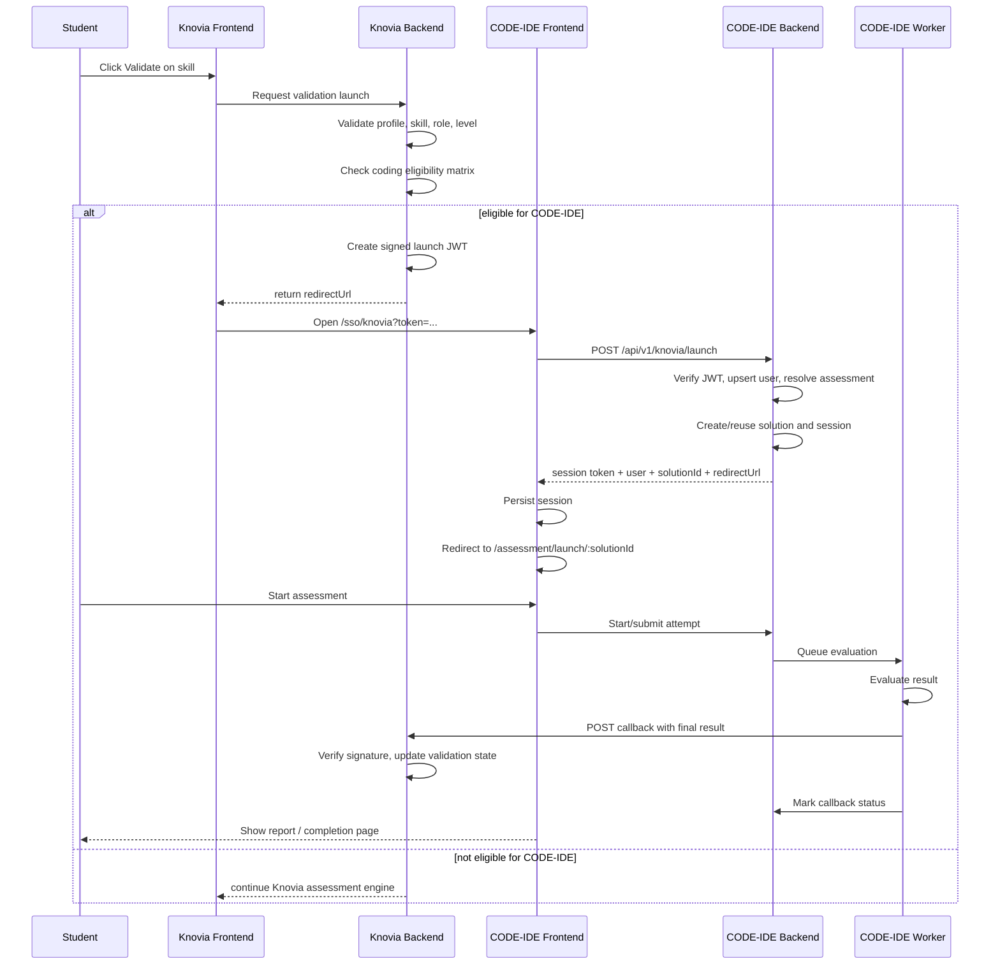
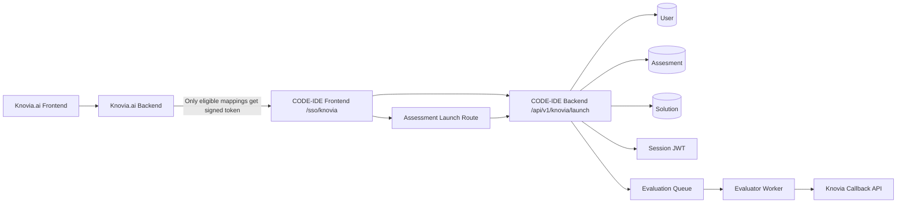
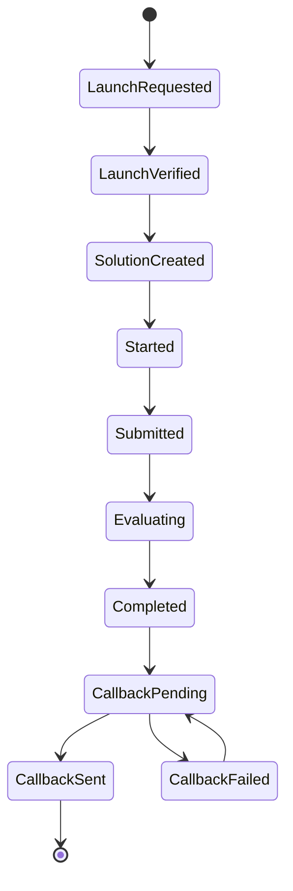

# Knovia.ai <> CODE-IDE Integration Execution Specification

## Document Purpose

This document is the execution-ready implementation spec for integrating `knovia.ai` with `CODE-IDE` so that:

- most skill validation remains in Knovia using the existing assessment engine
- only the explicitly approved coding-environment mappings are launched in `CODE-IDE`
- the student reaches `CODE-IDE` through SSO
- `CODE-IDE` evaluates the attempt and sends the final result back to Knovia

This document is written to reduce implementation ambiguity. It is intended for the developer building the integration.

---

## Scope

This spec covers:

- Knovia launch flow for selected coding-environment skill mappings
- CODE-IDE SSO consumption and attempt creation
- assessment resolution in CODE-IDE
- callback/result sync from CODE-IDE back to Knovia
- model changes required on both sides
- route and file-level change map
- security, idempotency, and acceptance criteria

This spec does not cover:

- UI design changes outside the integration touchpoints
- long-term analytics/reporting beyond the callback payload
- advanced retry/queue backoff infrastructure beyond the minimum required callback retry path

Important correction:

- the routing rule is no longer "all Advanced skills go to CODE-IDE"
- the routing rule is "only approved `(skillId, roleId, level)` mappings go to CODE-IDE"
- all other validations, including unapproved Advanced validations, must continue to use Knovia's own assessment engine

---

## Knovia Codebase Context The Developer Should Assume

This section exists because the implementing developer may not have seen the Knovia codebase at all.

The points below are the distilled repo-scan findings from Knovia and should be treated as the working context for the integration. The developer should not need to rediscover these basics before starting.

### Knovia product behavior today

- each skill has three proficiency levels:
  - `Beginner`
  - `Intermediate`
  - `Advanced`
- `Beginner` and `Intermediate` are already handled by Knovia's MCQ engine
- `Advanced` is currently represented in data, but there is no separate external coding-lab integration yet
- latest scan confirms `Advanced` still goes into the internal MCQ flow unless explicitly branched
- latest product decision says CODE-IDE routing is not based only on `Advanced`
- CODE-IDE routing must use an allowlist of selected `(skillId, roleId, level)` combinations
- the user already sees a `Validate` action in Knovia
- `profileId` already exists in Knovia auth and assessment-linked data

### Knovia database and validation reality

From the Knovia scan:

- skill levels are defined in Prisma-backed data models
- `Advanced` already exists as a legitimate level in Knovia data
- backend-supported levels remain:
  - `Beginner`
  - `Intermediate`
  - `Advanced`
- current assessment/result models in Knovia are oriented around MCQ-style attempt storage
- external coding-lab attempts should not be forced into the same internal MCQ `Assessment` / `Answer` storage shape
- frontend has some `Expert` references, but backend Prisma/Zod does not support `Expert`
- until product confirms otherwise, `Expert` must be treated as frontend contract drift and not added to the CODE-IDE integration contract

### Coding-environment eligibility

The coding environment must be launched only for the approved mapping matrix:

- see `KNOVIA_CODEIDE_CODING_ELIGIBILITY_MATRIX.md`

The eligibility check must use:

- `skillId`
- `roleId`
- `level`

Do not route based only on:

- skill name
- skill level
- whether the level is `Advanced`

Reason:

- the approved matrix includes `Beginner` and `Intermediate` mappings
- some non-approved skills and levels must remain inside Knovia
- a language skill by itself is not enough to decide routing

### Knovia frontend reality

The current validation flow does not yet route selected coding-environment mappings to CODE-IDE. The existing frontend flow is still shaped around the internal MCQ assessment flow.

The important current Knovia frontend files are:

- `SkillModal/index.tsx`
  - renders skill/proficiency-level selection behavior
- `ProfileSkillList/index.tsx`
  - renders the visible `Validate` button
  - contains click/label logic that currently does not distinguish external advanced launch strongly enough
  - latest scan shows the click handler currently passes only `profileSkillId`
- `SkillManagement/index.tsx`
  - currently drives the assessment launch decision
  - today this is the point where MCQ flow is opened
  - latest scan confirms this is where `Advanced` must branch to CODE-IDE instead of MCQ
- `quiz-assessment/page.tsx`
  - current internal Knovia MCQ assessment page
- `useSkillAssessment.ts`
  - hook used by Knovia’s current internal assessment launch flow
- `skillAssessment.service.ts`
  - frontend service layer calling Knovia backend assessment launch APIs

### Knovia backend reality

The current Knovia backend already knows how to:

- read `profileId` from auth
- validate ownership of skill-linked assessment actions
- create internal assessment attempts
- store assessment answers/results
- update validated skill state

The important current Knovia backend files are:

- `assessmentRoute.js`
  - current backend routes for assessment start/submit behavior
- `assessmentController.js`
  - current internal MCQ launch and submit handling
  - currently treats Advanced as a normal internal level unless explicitly blocked
  - latest scan confirms `Advanced` must be rejected before the call to `validateAssessment()`, because `validateAssessment()` increments MCQ attempt counters
- `assessmentService.js`
  - attempt policy, cooldown, and review rules
  - contains `validateAssessment()` attempt-tracking behavior
- `authenticate.js`
  - attaches `req.user.profileId` from JWT
- `jwtUtils.js`
  - existing signing helpers and JWT handling patterns
- `sectionSchemas.js`
  - request/response payload validation area
  - backend schemas still support only `Beginner`, `Intermediate`, and `Advanced`
- `makeSectionDirty.js`
  - update helper relevant when skill state changes after external validation

### Latest Knovia scan details to preserve

- `schema.prisma` contains `ProfileSkill` with `profileId`, `skillId`, `level`, `validated`, and `attempts`
- `schema.prisma` contains MCQ `Assessment` storage, but it is not suitable as the only storage for CODE-IDE attempts
- `ProfileSkillList/index.tsx` renders the visible `Validate` button
- `ProfileSkillList/index.tsx` currently sends only `profileSkillId` to the parent click handler
- `SkillManagement/index.tsx` currently opens the MCQ instruction modal and navigates to `/quiz-assessment?skillId=<profileSkillId>`
- `skillAssessment.service.ts` currently calls `/api/skillAssessment/start?profileSkillId=...`
- `assessmentController.js` currently loads questions by `skillId` and `level`, so `Advanced` is still accepted by MCQ
- `assessmentController.js` creates `Assessment` and `Answer` records during MCQ submission
- `assessmentController.js` updates `ProfileSkill.validated = "VALIDATED"` after a passing MCQ result
- `authenticate.js` attaches decoded JWT context to `req.user`
- `jwtUtils.js` includes `profileId` in the JWT
- `AuthContextProvider.tsx` exposes `profileId` on the frontend auth context
- Razorpay webhook handling is the safest existing pattern for signed CODE-IDE callback verification because it uses raw body and HMAC verification

### Reusable patterns already present in Knovia

Knovia already has examples of:

- signed/tokenized flows
- webhook/callback style integrations
- auth-backed user context using `profileId`

Useful examples in Knovia:

- signed mentor feedback links
- Razorpay webhook signature validation
- AI parser / scoring callback routes

These patterns mean the CODE-IDE integration should reuse Knovia’s existing backend integration style rather than inventing a completely new mechanism.

### What Knovia does not yet have

Knovia does not yet have:

- a dedicated backend launch endpoint for CODE-IDE eligible assessments
- a dedicated external-attempt model for coding-lab attempts
- a signed callback receiver specifically for CODE-IDE results
- a frontend split where `Advanced` clearly routes outside the MCQ engine

### Practical Knovia interpretation for this integration

The developer should assume:

- Knovia remains the source of truth for skill validation state
- Knovia issues the SSO launch
- Knovia owns whether a candidate is allowed another advanced attempt
- Knovia receives the final external result and decides how to mark the skill
- CODE-IDE is only the advanced execution engine, not the master profile system

---

## Default Product Decisions

These are the assumed defaults for implementation unless product explicitly changes them before development starts.

### Assessment resolution

- one CODE-IDE assessment can be mapped to one or more approved Knovia role-skill-level combinations
- the resolved CODE-IDE assessment is selected by:
  - `skillId`
  - `roleId`
  - `level`
- only approved combinations in `KNOVIA_CODEIDE_CODING_ELIGIBILITY_MATRIX.md` should launch CODE-IDE
- non-approved combinations must continue inside Knovia's own assessment engine

### Attempt policy

- one Knovia launch creates one CODE-IDE attempt record
- reattempts are allowed only if Knovia issues a new launch token and a new `attemptId`
- Knovia is the source of truth for whether another coding-environment attempt is permitted
- Knovia is also the source of truth for whether a given role-skill-level combination is coding-lab eligible

### Verification rule

- CODE-IDE sends result after evaluation completes
- Knovia decides whether the skill becomes `VALIDATED`
- `verified` in callback means CODE-IDE believes the attempt passed the configured threshold

### Launch behavior

- student is redirected from Knovia directly into CODE-IDE
- CODE-IDE may show an instructions/ready screen before the timer starts
- assessment must not require manual role/skill selection for Knovia-launched users

### Callback rule

- callback happens after final evaluation
- callback is server-to-server
- callback must be idempotent

---

## Current CODE-IDE Notes After Latest Pull

These notes reflect the currently pulled CODE-IDE repos and are important because the integration should be implemented on top of the newer structure, not the older file layout.

### Frontend reality

- auth state is still local and token-based in:
  - `code-ide-ui/context/AuthContext.tsx`
- the assessment UI has been modularized under:
  - `code-ide-ui/modules/assesment/*`
- the main assessment entry component now lives at:
  - `code-ide-ui/modules/assesment/components/pages/AssesmentEntry.tsx`
- the current assessment entry flow already includes:
  - metadata fetch
  - passcode gate
  - device check
  - AV permission/proctoring preflight

### Backend reality

- assessment routes already include:
  - `GET /api/v1/assesments/info/:id`
  - `POST /api/v1/assesments/verify-passcode`
- proctoring infrastructure and routes already exist
- the `Assesment` model already includes:
  - `isProctored`
  - `isAvEnabled`
  - `isScreenCapture`
  - `passCodeEnabled`
  - `passCode`
  - `isPublished`
  - `isActive`
- the `Solution` model already includes proctoring data, but not Knovia external-attempt metadata
- the worker still calls `examEvaluator(job)` without `await`, which remains a blocking reliability issue for callback delivery

### Practical implication

The Knovia SSO integration should be layered into the existing assessment flow, not built as a parallel flow that skips:

- passcode checks
- assessment preflight
- device checks
- proctoring requirements configured on the assessment

---

## System Overview

### High-level flow



### Runtime architecture



---

## Shared Data Contract

### Shared identity

- `profileId` is the primary cross-platform identity key

### Shared business identifiers

- `profileSkillId`
- `skillId`
- `roleId`
- `level`
- `attemptId`

### Shared URLs

- `callbackUrl`
- `returnUrl`

---

## API Contracts

## 0. Knovia frontend to Knovia backend launch API

This is the API called by Knovia frontend when a user clicks `Validate` for a skill.

Recommended route, matching the current Knovia assessment-service style:

`GET /api/codeide/launch?profileSkillId=<profileSkillId>`

Alternative if the team standardizes on JSON mutation APIs:

`POST /api/codeide/launch`

```json
{
  "profileSkillId": 999
}
```

The Knovia backend must:

- read `profileId` from authenticated `req.user`
- load the `ProfileSkill`
- verify that the skill belongs to the authenticated profile
- resolve the associated `roleId`
- check whether `(skillId, roleId, level)` exists in the approved coding eligibility matrix
- if not eligible, do not create a CODE-IDE launch token
- create a `CodeIdeAssessmentAttempt` record
- create a signed launch token for CODE-IDE
- return the CODE-IDE redirect URL

Response:

```json
{
  "success": true,
  "assessmentEngine": "code-ide",
  "redirectUrl": "https://lab.knovia.ai/sso/knovia?token=<short-lived-jwt>",
  "attemptId": "uuid"
}
```

Important:

- this route must not call `validateAssessment()` unless the business explicitly wants CODE-IDE launches to consume MCQ attempts
- latest scan says `validateAssessment()` increments MCQ attempt tracking, so CODE-IDE launch should use its own attempt record
- if the mapping is not eligible for CODE-IDE, the backend should return a clear response that tells the frontend to continue the normal Knovia assessment engine

## 1. Knovia launch redirect

### Knovia backend output to its frontend

Knovia frontend should receive:

```json
{
  "redirectUrl": "https://lab.knovia.ai/sso/knovia?token=<short-lived-jwt>"
}
```

### JWT claims sent by Knovia

```json
{
  "iss": "knovia",
  "aud": "code-ide",
  "jti": "uuid",
  "profileId": 123,
  "userId": 45,
  "email": "student@example.com",
  "name": "Student Name",
  "profileSkillId": 999,
  "roleId": 2,
  "roleName": "Software Engineer - Application Development",
  "skillId": 12,
  "skillName": "JavaScript",
  "level": "Intermediate",
  "attemptId": "uuid",
  "callbackUrl": "https://api.knovia.ai/api/skillAssessment/code-ide/callback",
  "returnUrl": "https://knovia.ai/my-profile?assessment=code-ide",
  "iat": 1760000000,
  "exp": 1760000600
}
```

### Launch token rules

- expiry: `10 minutes` maximum
- algorithm: `HS256` if shared secret is used, or `RS256` if asymmetric signing is preferred
- `jti` must be unique
- `aud` must be `code-ide`
- `iss` must be `knovia`

---

## 2. CODE-IDE launch endpoint

### Route

`POST /api/v1/knovia/launch`

### Request

```json
{
  "token": "<knoviaLaunchJwt>"
}
```

### Success response

```json
{
  "success": true,
  "token": "codeIdeSessionJwt",
  "user": {
    "_id": "mongo-id",
    "userId": "knovia_123",
    "profileId": 123,
    "email": "student@example.com",
    "name": "Student Name",
    "authSource": "knovia"
  },
  "solutionId": "solution-mongo-id",
  "assessmentId": "assessment-mongo-id",
  "redirectUrl": "/assessment/launch/solution-mongo-id"
}
```

### Failure responses

#### Invalid token

```json
{
  "success": false,
  "code": "INVALID_LAUNCH_TOKEN",
  "message": "Launch token is invalid or expired."
}
```

#### Assessment not mapped

```json
{
  "success": false,
  "code": "CODE_IDE_ASSESSMENT_NOT_FOUND",
  "message": "No CODE-IDE assessment is mapped to this role-skill-level combination."
}
```

#### Not eligible for CODE-IDE

```json
{
  "success": false,
  "code": "CODE_IDE_NOT_ELIGIBLE",
  "message": "This role-skill-level combination should continue in Knovia assessment engine."
}
```

---

## 3. CODE-IDE callback to Knovia

### Callback timing

- send callback only after evaluation is complete
- do not callback on raw submit before scoring is finalized

### Callback route on Knovia

Recommended:

`POST /api/skillAssessment/code-ide/callback`

### Callback payload

```json
{
  "eventId": "uuid",
  "attemptId": "uuid-from-knovia",
  "codeIdeAttemptId": "solutionId",
  "profileId": 123,
  "profileSkillId": 999,
  "roleId": 2,
  "skillId": 12,
  "level": "Intermediate",
  "status": "completed",
  "score": 82,
  "maxScore": 100,
  "passed": true,
  "verified": true,
  "reportUrl": "https://lab.knovia.ai/assessment/preview/solutionId",
  "certificateUrl": "https://api.lab.knovia.ai/api/v1/assesments/certificate/solutionId",
  "completedAt": "2026-04-25T10:00:00Z"
}
```

### Callback headers

Recommended minimum:

```http
Content-Type: application/json
X-CodeIde-Signature: <hmac-signature>
X-CodeIde-Event-Id: <eventId>
```

### Callback rules

- Knovia must verify signature
- Knovia must handle callback idempotently by:
  - `attemptId`
  - or `codeIdeAttemptId`
- Knovia must verify payload matches original launch record:
  - `profileId`
  - `profileSkillId`
  - `skillId`
  - `level`

---

## Data Model Changes

## CODE-IDE backend

### User model

File:

- `codeide-backend-services/assesment-platform-api/models/User.js`

Add fields:

```js
profileId: {
  type: Number,
  index: true,
  sparse: true
},
authSource: {
  type: String,
  enum: ["local", "knovia"],
  default: "local"
}
```

Rules:

- `profileId` must be unique for Knovia-linked users
- local-only users may have `profileId = null`

### Assesment model

File:

- `codeide-backend-services/assesment-platform-api/models/Assesment.js`

Current model already contains operational assessment flags:

- `skillId`
- `isProctored`
- `isAvEnabled`
- `isScreenCapture`
- `passCodeEnabled`
- `passCode`
- `isPublished`
- `isActive`

Add field:

```js
level: {
  type: String,
  enum: ["beginner", "intermediate", "advanced"],
  required: true
}
```

Rules:

- for this integration, launch resolution uses `skillId + roleId + level`
- SSO-launched attempts must still honor existing operational flags on the resolved assessment

### Solution model

File:

- `codeide-backend-services/assesment-platform-api/models/Solution.js`

Add fields:

```js
externalSource: {
  type: String,
  enum: ["knovia"],
},
externalAttemptId: {
  type: String,
},
profileId: {
  type: Number,
},
profileSkillId: {
  type: Number,
},
roleId: {
  type: Number,
},
skillId: {
  type: Number,
},
level: {
  type: String,
  enum: ["beginner", "intermediate", "advanced"]
},
callbackUrl: {
  type: String,
},
returnUrl: {
  type: String,
},
callbackStatus: {
  type: String,
  enum: ["pending", "sent", "failed"],
  default: "pending"
},
callbackSentAt: {
  type: Date,
},
callbackError: {
  type: String,
}
```

Indexes:

- fix existing `assessmentId` index typo if currently using `assesmentId`
- add unique or strongly constrained idempotency index:

```js
{ externalSource: 1, externalAttemptId: 1 }
```

### Optional dedicated mapping model

If `Assesment` does not cleanly map one coding assessment per role-skill-level combination, add a mapping model:

`SkillAssessmentMapping`

Fields:

- `skillId`
- `roleId`
- `level`
- `assessmentId`
- `isActive`

If the existing data model can support direct `skillId + level` lookup, this model is not required.

---

## Knovia backend

### New external attempt model

Knovia already has MCQ-specific assessment models. For external CODE-IDE sync, add a dedicated model such as:

`CodeIdeAssessmentAttempt`

Fields:

- `attemptId`
- `profileId`
- `profileSkillId`
- `roleId`
- `skillId`
- `level`
- `status`
- `score`
- `maxScore`
- `passed`
- `verified`
- `reportUrl`
- `certificateUrl`
- `codeIdeAttemptId`
- `launchTokenJti`
- `callbackEventId`
- `callbackReceivedAt`
- `callbackPayload`
- `launchedAt`
- `completedAt`

Purpose:

- stores the lifecycle of external CODE-IDE validation
- keeps external coding assessment data separate from internal MCQ `Assessment` / `Answer` records
- enables idempotency by `attemptId`, `codeIdeAttemptId`, and/or `callbackEventId`

---

## CODE-IDE File-Level Change Map

## Backend

### 1. Mount Knovia routes

File:

- `codeide-backend-services/assesment-platform-api/index.js`

Change:

- add router mount:
  - `/api/v1/knovia`

### 2. Auth session bootstrap helper

File:

- `codeide-backend-services/assesment-platform-api/services/auth/auth.service.js`

Change:

- expose helper to create CODE-IDE session token for an existing/upserted user
- example:
  - `createSessionForUser(user)`

### 3. Config

File:

- `codeide-backend-services/assesment-platform-api/config/config.js`

Add env-driven config:

- `KNOVIA_SSO_SECRET`
- `CODE_IDE_CALLBACK_SECRET`
- `CODE_IDE_FRONTEND_URL`
- `KNOVIA_CALLBACK_AUDIENCE`

Also move any hardcoded auth secrets to env if still present.

### 4. New Knovia route

New file:

- `codeide-backend-services/assesment-platform-api/routes/knovia.routes.js`

Routes:

- `POST /launch`

Optional later:

- `GET /health`
- `POST /callback-test`

### 5. New Knovia controller

New file:

- `codeide-backend-services/assesment-platform-api/controllers/knovia.controller.js`

Responsibilities:

- validate launch request body
- call launch service
- return session bootstrap payload

### 6. New Knovia SSO service

New file:

- `codeide-backend-services/assesment-platform-api/services/knoviaSso.service.js`

Responsibilities:

- verify Knovia JWT
- validate issuer/audience/expiry
- upsert user using `profileId`
- resolve the CODE-IDE assessment from the approved `(skillId, roleId, level)` mapping
- create or reuse solution by external attempt id
- return:
  - local session token
  - user
  - solutionId
  - assessmentId
  - redirectUrl

### 7. Solution creation/start integration

Files to inspect/update:

- `codeide-backend-services/assesment-platform-api/controllers/assesmentCreateSolution.js`
- `codeide-backend-services/assesment-platform-api/controllers/assessmentStart.js`
- `codeide-backend-services/assesment-platform-api/controllers/assessmentInfo.js`
- `codeide-backend-services/assesment-platform-api/controllers/verifyPasscode.js`

Change:

- either reuse existing solution creation path through a service
- or add a Knovia-specific creation path that writes external metadata fields
- reuse the existing assessment metadata/passcode path where applicable instead of bypassing it

### 8. Evaluation callback

File:

- `codeide-backend-services/assesment-platform-api/workers/evaluator.js`

Change:

- after final evaluation save, if:
  - `solution.externalSource === "knovia"`
  - `solution.callbackStatus !== "sent"`
- send callback to Knovia
- persist callback status

Also required:

- callback failures must set `callbackStatus = failed`
- log `callbackError`

### 9. Worker await fix

File:

- `codeide-backend-services/assesment-platform-api/workers/worker.js`

Change:

- ensure evaluator execution is awaited so callback delivery reflects actual job completion

### 10. Ownership/security hardening

Files to inspect:

- `codeide-backend-services/assesment-platform-api/routes/assesmentRouter.js`
- `codeide-backend-services/assesment-platform-api/middlewares/isAllowed.js`

Required fixes:

- `/solution/:solutionId` must verify ownership or authorized access
- certificate access strategy must be reviewed
- authorization middleware must not stay as a stub for production use

---

## CODE-IDE Frontend File-Level Change Map

### 1. Route constants

File:

- `code-ide-ui/constants/ApiRoutes.ts`

Add:

- `KNOVIA_ROUTES.LAUNCH = "/api/v1/knovia/launch"`

### 2. SSO page

New file:

- `code-ide-ui/app/sso/knovia/page.tsx`

Responsibilities:

- read `token` from query string
- call backend launch endpoint
- persist session
- redirect to returned `redirectUrl`

### 3. Auth bootstrap

File:

- `code-ide-ui/context/AuthContext.tsx`

Change:

- expose helper such as:
  - `bootstrapSession(token, user)`

Responsibilities:

- persist auth token
- persist user
- update in-memory auth state
- align with the current localStorage keys already used by the frontend:
  - `knovia_token`
  - `knovia_user`

### 4. Direct launch route

Recommended new route:

- `code-ide-ui/app/assessment/launch/[solutionId]/page.tsx`

Why:

- cleaner than current `/user?assessmentId=...&userId=...`
- aligns with external attempt identity

### 5. Assessment bootstrap

File:

- `code-ide-ui/modules/assesment/components/pages/AssesmentEntry.tsx`

Change:

- support loading attempt by `solutionId`
- do not depend only on `assessmentId` and `userId` query params
- keep the existing assessment preflight behavior intact:
  - assessment info fetch
  - passcode verification
  - device check
  - AV readiness if enabled

### 6. Existing home flow

File:

- `code-ide-ui/components/ui/home/Entry.tsx`

Change:

- no required change for standard users
- Knovia-launched users should bypass this route entirely

### 7. Existing route constants

File:

- `code-ide-ui/constants/ApiRoutes.ts`

Change:

- add Knovia launch routes into the existing API route constant structure
- keep naming consistent with:
  - `AUTH_ROUTES`
  - `ASSESMENT_ROUTES`
  - `PROCTORING_ROUTES`
  - `ADMIN_ROUTES`

---

## Knovia File-Level Change Map

Based on the repo scan already performed.

The goal of this section is to let the developer understand the Knovia side without opening the full codebase first.

### Knovia current flow today

Today the Knovia path is effectively:

1. user sees a skill and clicks `Validate`
2. frontend skill-management flow launches the internal assessment path
3. the internal Knovia MCQ engine starts using:
   - `profileSkillId`
4. Knovia backend:
   - validates ownership through `profileId`
   - selects MCQ questions by skill and level
   - stores attempt state
5. on completion, Knovia stores answers/results internally and may mark the skill as validated

For `Advanced`, this current behavior must be interrupted and replaced with external CODE-IDE launch behavior.

### Frontend changes

#### 1. Validate button launch logic

File:

- `ProfileSkillList/index.tsx`

Current role:

- renders the visible skill list and `Validate` action
- contains the current click path and visible label logic
- latest scan says the handler currently passes only `profileSkillId`

Change:

- update the click contract so `onItemClick` can receive the full skill object or at least:
  - `profileSkillId`
  - `level`
  - `skillId`
- `roleId` must be available to the backend either through the `ProfileSkill` relation or explicit request context
- do not treat advanced exactly like MCQ launch

#### 2. Skill management launch branching

File:

- `SkillManagement/index.tsx`

Current role:

- decides what assessment flow to open when validation starts
- today it opens the MCQ-oriented instructions/assessment path
- latest scan says this file currently opens the MCQ modal and navigates to `/quiz-assessment?skillId=<profileSkillId>`

Change:

- call the Knovia backend launch decision endpoint for validation
- if backend returns `assessmentEngine = "code-ide"`:
  - redirect browser to returned `redirectUrl`
- if backend returns `assessmentEngine = "knovia"`:
  - keep existing MCQ/assessment flow
- do not decide CODE-IDE eligibility only in frontend, because the final source of truth must be backend-side mapping data

#### 3. Service layer

File:

- `skillAssessment.service.ts`

Current role:

- frontend service wrapper around current assessment launch APIs
- currently calls `/api/skillAssessment/start?profileSkillId=...`

Add:

- `launchCodeIdeAssessment(profileSkillId)`

### Backend changes

#### 1. Route additions

File:

- `assessmentRoute.js`

Current role:

- current backend assessment route mount for internal assessment actions

Add:

- authenticated launch route:
  - `GET /api/codeide/launch?profileSkillId=...`
  - or `POST /api/codeide/launch` if the team prefers body-based mutation routes
- signed callback route:
  - `POST /api/codeide/callback`

Mounting note:

- latest scan suggests adding the route near authenticated user routes in `server.js`

#### 2. Controller logic

File:

- `assessmentController.js`

Current role:

- starts internal MCQ assessment flow
- validates the request against the user/profile context
- stores internal assessment progress and result updates

Change:

- reject Advanced in internal MCQ start flow
- CODE-IDE eligible mappings must not continue into Knovia MCQ engine
- place this check before `validateAssessment()` runs, because latest scan confirms `validateAssessment()` increments MCQ attempt counters
- update this rule from a hardcoded Advanced-only block to a coding-eligibility block:
  - if `(skillId, roleId, level)` is CODE-IDE eligible, do not start MCQ
  - if not eligible, keep the existing Knovia assessment engine

#### 3. New service/controller for external assessment

Recommended new files:

- `src/controllers/codeIdeAssessmentController.js`
- `src/controllerServices/ForAssessment/codeIdeAssessmentService.js`

Responsibilities:

- issue signed launch JWT
- create launch attempt record
- return redirect URL
- process callback
- avoid consuming MCQ attempt counters unless explicitly required by product

#### 4. Validation schemas

File:

- `sectionSchemas.js`

Current role:

- request/response validation schema definitions

Add:

- launch payload schema
- callback payload schema
- keep supported level validation aligned to backend reality:
  - `Beginner`
  - `Intermediate`
  - `Advanced`

Do not add `Expert` unless product confirms it and Prisma/Zod/backend validation are updated together.

#### 5. JWT helper

File:

- `jwtUtils.js`

Current role:

- JWT and signed-link helper area already used elsewhere in Knovia

Change:

- add dedicated CODE-IDE launch token helpers
- do not reuse generic JWT secret blindly

---

## Security Rules

### Launch token security

- token expiry must be short
- verify:
  - `iss`
  - `aud`
  - `exp`
  - `jti`
- do not trust frontend-provided identity fields without JWT verification

### Callback security

- callback must be signed
- Knovia must verify signature before applying any update
- callback must be idempotent
- use `eventId` and/or `codeIdeAttemptId` for idempotency
- prefer the existing Razorpay-style HMAC verification pattern over weaker callback examples

### Session security

- CODE-IDE must issue its own local session token after successful launch verification
- do not reuse the Knovia token as the internal CODE-IDE session token

### Access control

- solution preview/report access must be ownership-based or signed-link based
- certificate access must be reviewed before external rollout
- current public certificate-by-solutionId behavior should not be assumed acceptable for the final Knovia integration

---

## State Model

### External CODE-IDE attempt state



### Meaning

- `LaunchRequested`: Knovia issued redirect URL/token
- `LaunchVerified`: CODE-IDE validated the token
- `SolutionCreated`: CODE-IDE created/reused attempt record
- `Started`: student began assessment
- `Submitted`: student completed submission
- `Evaluating`: worker is evaluating the attempt
- `Completed`: evaluation result is final
- `CallbackPending`: callback required but not confirmed yet
- `CallbackSent`: callback succeeded
- `CallbackFailed`: callback failed and should be retried

---

## Result Rules

### Status mapping from CODE-IDE to Knovia

Recommended:

- `completed`
- `failed`
- `expired`
- `aborted`

For the first implementation, minimum required status is:

- `completed`

### Verification fields

- `passed`: whether CODE-IDE scoring threshold is cleared
- `verified`: whether the CODE-IDE validation should count as valid

Default rule:

- `verified = passed`

If Knovia later needs manual-review logic, `verified` can diverge from `passed`.

---

## Error Handling

## Launch errors

Knovia frontend should show user-friendly fallback when:

- token expired
- assessment mapping missing
- launch token invalid
- CODE-IDE launch unavailable

## Callback errors

CODE-IDE backend should:

- retry failed callbacks
- keep callback failure status on the solution record
- not lose the final attempt result if callback fails

Minimum retry policy:

- retry `3` times
- exponential or fixed short delay

---

## Current Known Contract Drift

### `Expert` level drift

Latest Knovia scan found frontend references to `Expert`, but backend Prisma/Zod still supports only:

- `Beginner`
- `Intermediate`
- `Advanced`

This is a product/data contract drift.

Required handling before implementation:

- if `Expert` is not real product scope, remove or normalize frontend `Expert` references
- if `Expert` is real product scope, update Prisma, backend validation, frontend types, and integration contract together
- do not silently convert unknown levels to `Beginner`
- CODE-IDE integration should only accept mappings listed in `KNOVIA_CODEIDE_CODING_ELIGIBILITY_MATRIX.md` until the backend contract changes

### Silent downgrade risk

Latest scan found one frontend handler can silently convert an unknown level to `Beginner`.

This must not happen for external validation because it can send the wrong assessment path.

Rule:

- unknown levels should fail validation visibly
- approved coding matrix mappings should launch CODE-IDE
- non-approved mappings should use Knovia's own assessment engine

---

## Coding Eligibility Rule

The final launch decision must be made by Knovia backend using an allowlist.

Eligibility key:

```text
skillId + roleId + level
```

If the key exists in `KNOVIA_CODEIDE_CODING_ELIGIBILITY_MATRIX.md`:

- Knovia creates a CODE-IDE launch attempt
- Knovia signs the CODE-IDE SSO token
- frontend redirects to `lab.knovia.ai`

If the key does not exist:

- Knovia continues with its own assessment engine
- no CODE-IDE token is created
- no CODE-IDE attempt is created

This is required because the approved CODE-IDE scope includes some `Beginner` and `Intermediate` mappings, and not every `Advanced` skill should automatically move to CODE-IDE.

---

## Acceptance Criteria

## Functional

1. A user clicking `Validate` on a CODE-IDE eligible mapping in Knovia is redirected to CODE-IDE successfully.
2. CODE-IDE does not require manual login for that flow.
3. CODE-IDE does not require manual role/skill selection for that flow.
4. CODE-IDE resolves the correct assessment from the incoming `skillId + roleId + level`.
5. CODE-IDE creates or reuses the user using `profileId`.
6. CODE-IDE stores external launch metadata on the attempt.
7. On completion and evaluation, CODE-IDE sends callback to Knovia.
8. Knovia receives the callback and updates validation state.
9. Knovia stores report URL and certificate URL.

## Negative-path

1. Expired launch token is rejected.
2. Invalid signature launch token is rejected.
3. Missing CODE-IDE assessment mapping is handled safely.
4. Duplicate callback does not create duplicate validation updates.
5. Callback with mismatched `profileId` / `skillId` / `profileSkillId` is rejected.

## Security

1. Knovia-issued launch token is short-lived.
2. CODE-IDE issues its own local session after successful launch.
3. Callback is signed and verified.
4. Attempt/result access is not publicly exposed without deliberate policy.

---

## Test Matrix

### Knovia

- approved coding-environment mappings launch CODE-IDE
- Beginner/Intermediate unchanged
- non-approved mappings continue in Knovia's own assessment engine
- CODE-IDE eligible mappings are rejected from MCQ start before MCQ attempt counters are incremented
- Callback updates profile skill status
- Duplicate callback is ignored safely
- `Expert` frontend drift is removed, blocked, or formally added to backend before release

### CODE-IDE

- launch token verification works
- user upsert by `profileId` works
- role-skill-level assessment resolution works
- solution creation with external metadata works
- assessment launch by `solutionId` works
- evaluator sends callback after result finalization
- callback failure is recorded

---

## Recommended Implementation Order

1. Add schema/model changes in CODE-IDE:
   - `User`
   - `Assesment`
   - `Solution`
2. Wire the integration into the current modular assessment flow:
   - `modules/assesment/*`
   - passcode flow
   - device check
   - AV readiness flow
3. Add Knovia-side launch and callback endpoints.
4. Add CODE-IDE launch endpoint and SSO service.
5. Add CODE-IDE frontend SSO page and session bootstrap helper.
6. Add solution-based launch route.
7. Add evaluator callback sender.
8. Add security fixes:
   - worker await
   - ownership checks
   - certificate/report access review
9. Run end-to-end integration testing.

---

## Developer Checklist

### Knovia

- [ ] Block CODE-IDE eligible mappings from internal MCQ launch path
- [ ] Add CODE-IDE launch endpoint
- [ ] Add CODE-IDE callback endpoint
- [ ] Add signed launch JWT helper
- [ ] Add external attempt record model
- [ ] Update frontend Validate flow for CODE-IDE eligible mappings
- [ ] Update validation state on successful callback

### CODE-IDE backend

- [ ] Add `/api/v1/knovia` route mount
- [ ] Add launch endpoint
- [ ] Add Knovia JWT verification service
- [ ] Add user upsert by `profileId`
- [ ] Add role-skill-level assessment resolution
- [ ] Add external metadata to `Solution`
- [ ] Add callback sender after evaluation
- [ ] Add callback retry/failure tracking
- [ ] Fix worker await behavior
- [ ] Fix solution access authorization

### CODE-IDE frontend

- [ ] Add `/sso/knovia` page
- [ ] Add session bootstrap helper
- [ ] Add `/assessment/launch/[solutionId]`
- [ ] Load assessment by `solutionId`
- [ ] Bypass standard role/skill selection flow for Knovia launches

---

## Final Notes

This integration should be implemented as:

- Knovia = launch issuer and validation owner
- CODE-IDE = coding-environment assessment execution engine

The most important technical requirements are:

- `profileId` as the shared identity
- `skillId + roleId + level` as the assessment resolution rule
- signed launch token
- signed idempotent callback
- external metadata stored on CODE-IDE attempts

If these five pieces are done correctly, the integration will be structurally sound.
