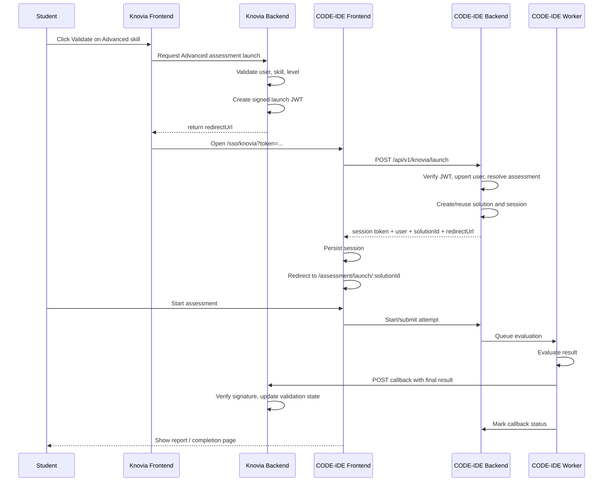
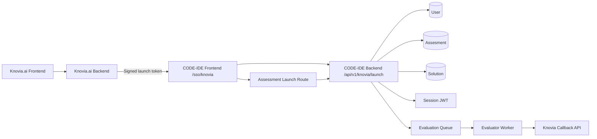
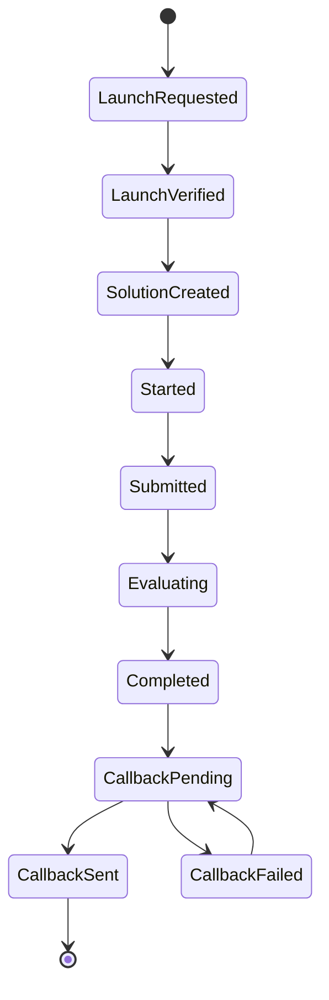

# Knovia.ai <> CODE-IDE Integration Execution Specification

## Document Purpose

This document is the execution-ready implementation spec for integrating `knovia.ai` with `CODE-IDE` so that:

- `Beginner` and `Intermediate` skill validation remain in Knovia using the MCQ engine
- `Advanced` skill validation is launched in `CODE-IDE`
- the student reaches `CODE-IDE` through SSO
- `CODE-IDE` evaluates the attempt and sends the final result back to Knovia

This document is written to reduce implementation ambiguity. It is intended for the developer building the integration.

---

## Scope

This spec covers:

- Knovia launch flow for `Advanced` skills
- CODE-IDE SSO consumption and attempt creation
- assessment resolution in CODE-IDE
- callback/result sync from CODE-IDE back to Knovia
- model changes required on both sides
- route and file-level change map
- security, idempotency, and acceptance criteria

This spec does not cover:

- UI design changes outside the integration touchpoints
- long-term analytics/reporting beyond the callback payload
- advanced retry/queue backoff infrastructure beyond the minimum required callback retry path

---

## Default Product Decisions

These are the assumed defaults for implementation unless product explicitly changes them before development starts.

### Assessment resolution

- one `Advanced` assessment is mapped to one `skillId`
- the resolved CODE-IDE assessment is selected by:
  - `skillId`
  - `level = advanced`

### Attempt policy

- one Knovia launch creates one CODE-IDE attempt record
- reattempts are allowed only if Knovia issues a new launch token and a new `attemptId`
- Knovia is the source of truth for whether another advanced attempt is permitted

### Verification rule

- CODE-IDE sends result after evaluation completes
- Knovia decides whether the skill becomes `VALIDATED`
- `verified` in callback means CODE-IDE believes the attempt passed the configured threshold

### Launch behavior

- student is redirected from Knovia directly into CODE-IDE
- CODE-IDE may show an instructions/ready screen before the timer starts
- assessment must not require manual role/skill selection for Knovia-launched users

### Callback rule

- callback happens after final evaluation
- callback is server-to-server
- callback must be idempotent

---

## Current CODE-IDE Notes After Latest Pull

These notes reflect the currently pulled CODE-IDE repos and are important because the integration should be implemented on top of the newer structure, not the older file layout.

### Frontend reality

- auth state is still local and token-based in:
  - `code-ide-ui/context/AuthContext.tsx`
- the assessment UI has been modularized under:
  - `code-ide-ui/modules/assesment/*`
- the main assessment entry component now lives at:
  - `code-ide-ui/modules/assesment/components/pages/AssesmentEntry.tsx`
- the current assessment entry flow already includes:
  - metadata fetch
  - passcode gate
  - device check
  - AV permission/proctoring preflight

### Backend reality

- assessment routes already include:
  - `GET /api/v1/assesments/info/:id`
  - `POST /api/v1/assesments/verify-passcode`
- proctoring infrastructure and routes already exist
- the `Assesment` model already includes:
  - `isProctored`
  - `isAvEnabled`
  - `isScreenCapture`
  - `passCodeEnabled`
  - `passCode`
  - `isPublished`
  - `isActive`
- the `Solution` model already includes proctoring data, but not Knovia external-attempt metadata
- the worker still calls `examEvaluator(job)` without `await`, which remains a blocking reliability issue for callback delivery

### Practical implication

The Knovia SSO integration should be layered into the existing assessment flow, not built as a parallel flow that skips:

- passcode checks
- assessment preflight
- device checks
- proctoring requirements configured on the assessment

---

## System Overview

### High-level flow



### Runtime architecture



---

## Shared Data Contract

### Shared identity

- `profileId` is the primary cross-platform identity key

### Shared business identifiers

- `profileSkillId`
- `skillId`
- `level`
- `attemptId`

### Shared URLs

- `callbackUrl`
- `returnUrl`

---

## API Contracts

## 1. Knovia launch redirect

### Knovia backend output to its frontend

Knovia frontend should receive:

```json
{
  "redirectUrl": "https://lab.knovia.ai/sso/knovia?token=<short-lived-jwt>"
}
```

### JWT claims sent by Knovia

```json
{
  "iss": "knovia",
  "aud": "code-ide",
  "jti": "uuid",
  "profileId": 123,
  "userId": 45,
  "email": "student@example.com",
  "name": "Student Name",
  "profileSkillId": 999,
  "skillId": 12,
  "skillName": "JavaScript",
  "level": "Advanced",
  "attemptId": "uuid",
  "callbackUrl": "https://api.knovia.ai/api/skillAssessment/code-ide/callback",
  "returnUrl": "https://knovia.ai/my-profile?assessment=code-ide",
  "iat": 1760000000,
  "exp": 1760000600
}
```

### Launch token rules

- expiry: `10 minutes` maximum
- algorithm: `HS256` if shared secret is used, or `RS256` if asymmetric signing is preferred
- `jti` must be unique
- `aud` must be `code-ide`
- `iss` must be `knovia`

---

## 2. CODE-IDE launch endpoint

### Route

`POST /api/v1/knovia/launch`

### Request

```json
{
  "token": "<knoviaLaunchJwt>"
}
```

### Success response

```json
{
  "success": true,
  "token": "codeIdeSessionJwt",
  "user": {
    "_id": "mongo-id",
    "userId": "knovia_123",
    "profileId": 123,
    "email": "student@example.com",
    "name": "Student Name",
    "authSource": "knovia"
  },
  "solutionId": "solution-mongo-id",
  "assessmentId": "assessment-mongo-id",
  "redirectUrl": "/assessment/launch/solution-mongo-id"
}
```

### Failure responses

#### Invalid token

```json
{
  "success": false,
  "code": "INVALID_LAUNCH_TOKEN",
  "message": "Launch token is invalid or expired."
}
```

#### Assessment not mapped

```json
{
  "success": false,
  "code": "ADVANCED_ASSESSMENT_NOT_FOUND",
  "message": "No advanced assessment is mapped to this skill."
}
```

#### Level mismatch

```json
{
  "success": false,
  "code": "UNSUPPORTED_LEVEL",
  "message": "Only advanced skill launches are supported through this endpoint."
}
```

---

## 3. CODE-IDE callback to Knovia

### Callback timing

- send callback only after evaluation is complete
- do not callback on raw submit before scoring is finalized

### Callback route on Knovia

Recommended:

`POST /api/skillAssessment/code-ide/callback`

### Callback payload

```json
{
  "eventId": "uuid",
  "attemptId": "uuid-from-knovia",
  "codeIdeAttemptId": "solutionId",
  "profileId": 123,
  "profileSkillId": 999,
  "skillId": 12,
  "level": "Advanced",
  "status": "completed",
  "score": 82,
  "maxScore": 100,
  "passed": true,
  "verified": true,
  "reportUrl": "https://lab.knovia.ai/assessment/preview/solutionId",
  "certificateUrl": "https://api.lab.knovia.ai/api/v1/assesments/certificate/solutionId",
  "completedAt": "2026-04-25T10:00:00Z"
}
```

### Callback headers

Recommended minimum:

```http
Content-Type: application/json
X-CodeIde-Signature: <hmac-signature>
X-CodeIde-Event-Id: <eventId>
```

### Callback rules

- Knovia must verify signature
- Knovia must handle callback idempotently by:
  - `attemptId`
  - or `codeIdeAttemptId`
- Knovia must verify payload matches original launch record:
  - `profileId`
  - `profileSkillId`
  - `skillId`
  - `level`

---

## Data Model Changes

## CODE-IDE backend

### User model

File:

- `codeide-backend-services/assesment-platform-api/models/User.js`

Add fields:

```js
profileId: {
  type: Number,
  index: true,
  sparse: true
},
authSource: {
  type: String,
  enum: ["local", "knovia"],
  default: "local"
}
```

Rules:

- `profileId` must be unique for Knovia-linked users
- local-only users may have `profileId = null`

### Assesment model

File:

- `codeide-backend-services/assesment-platform-api/models/Assesment.js`

Current model already contains operational assessment flags:

- `skillId`
- `isProctored`
- `isAvEnabled`
- `isScreenCapture`
- `passCodeEnabled`
- `passCode`
- `isPublished`
- `isActive`

Add field:

```js
level: {
  type: String,
  enum: ["beginner", "intermediate", "advanced"],
  required: true,
  default: "advanced"
}
```

Rules:

- for this integration, launch resolution uses `skillId + level=advanced`
- SSO-launched attempts must still honor existing operational flags on the resolved assessment

### Solution model

File:

- `codeide-backend-services/assesment-platform-api/models/Solution.js`

Add fields:

```js
externalSource: {
  type: String,
  enum: ["knovia"],
},
externalAttemptId: {
  type: String,
},
profileId: {
  type: Number,
},
profileSkillId: {
  type: Number,
},
skillId: {
  type: Number,
},
level: {
  type: String,
  enum: ["advanced"]
},
callbackUrl: {
  type: String,
},
returnUrl: {
  type: String,
},
callbackStatus: {
  type: String,
  enum: ["pending", "sent", "failed"],
  default: "pending"
},
callbackSentAt: {
  type: Date,
},
callbackError: {
  type: String,
}
```

Indexes:

- fix existing `assessmentId` index typo if currently using `assesmentId`
- add unique or strongly constrained idempotency index:

```js
{ externalSource: 1, externalAttemptId: 1 }
```

### Optional dedicated mapping model

If `Assesment` does not cleanly map one advanced assessment per skill, add a mapping model:

`SkillAssessmentMapping`

Fields:

- `skillId`
- `level`
- `assessmentId`
- `isActive`

If the existing data model can support direct `skillId + level` lookup, this model is not required.

---

## Knovia backend

### New external attempt model

Knovia already has MCQ-specific assessment models. For external CODE-IDE sync, add a dedicated model such as:

`CodeIdeAssessmentAttempt`

Fields:

- `attemptId`
- `profileId`
- `profileSkillId`
- `skillId`
- `level`
- `status`
- `score`
- `maxScore`
- `passed`
- `verified`
- `reportUrl`
- `certificateUrl`
- `codeIdeAttemptId`
- `callbackReceivedAt`
- `rawPayload`

Purpose:

- stores the lifecycle of advanced external validation
- keeps external coding assessment data separate from internal MCQ `Assessment` / `Answer` records

---

## CODE-IDE File-Level Change Map

## Backend

### 1. Mount Knovia routes

File:

- `codeide-backend-services/assesment-platform-api/index.js`

Change:

- add router mount:
  - `/api/v1/knovia`

### 2. Auth session bootstrap helper

File:

- `codeide-backend-services/assesment-platform-api/services/auth/auth.service.js`

Change:

- expose helper to create CODE-IDE session token for an existing/upserted user
- example:
  - `createSessionForUser(user)`

### 3. Config

File:

- `codeide-backend-services/assesment-platform-api/config/config.js`

Add env-driven config:

- `KNOVIA_SSO_SECRET`
- `CODE_IDE_CALLBACK_SECRET`
- `CODE_IDE_FRONTEND_URL`
- `KNOVIA_CALLBACK_AUDIENCE`

Also move any hardcoded auth secrets to env if still present.

### 4. New Knovia route

New file:

- `codeide-backend-services/assesment-platform-api/routes/knovia.routes.js`

Routes:

- `POST /launch`

Optional later:

- `GET /health`
- `POST /callback-test`

### 5. New Knovia controller

New file:

- `codeide-backend-services/assesment-platform-api/controllers/knovia.controller.js`

Responsibilities:

- validate launch request body
- call launch service
- return session bootstrap payload

### 6. New Knovia SSO service

New file:

- `codeide-backend-services/assesment-platform-api/services/knoviaSso.service.js`

Responsibilities:

- verify Knovia JWT
- validate issuer/audience/expiry
- upsert user using `profileId`
- resolve advanced assessment
- create or reuse solution by external attempt id
- return:
  - local session token
  - user
  - solutionId
  - assessmentId
  - redirectUrl

### 7. Solution creation/start integration

Files to inspect/update:

- `codeide-backend-services/assesment-platform-api/controllers/assesmentCreateSolution.js`
- `codeide-backend-services/assesment-platform-api/controllers/assessmentStart.js`
- `codeide-backend-services/assesment-platform-api/controllers/assessmentInfo.js`
- `codeide-backend-services/assesment-platform-api/controllers/verifyPasscode.js`

Change:

- either reuse existing solution creation path through a service
- or add a Knovia-specific creation path that writes external metadata fields
- reuse the existing assessment metadata/passcode path where applicable instead of bypassing it

### 8. Evaluation callback

File:

- `codeide-backend-services/assesment-platform-api/workers/evaluator.js`

Change:

- after final evaluation save, if:
  - `solution.externalSource === "knovia"`
  - `solution.callbackStatus !== "sent"`
- send callback to Knovia
- persist callback status

Also required:

- callback failures must set `callbackStatus = failed`
- log `callbackError`

### 9. Worker await fix

File:

- `codeide-backend-services/assesment-platform-api/workers/worker.js`

Change:

- ensure evaluator execution is awaited so callback delivery reflects actual job completion

### 10. Ownership/security hardening

Files to inspect:

- `codeide-backend-services/assesment-platform-api/routes/assesmentRouter.js`
- `codeide-backend-services/assesment-platform-api/middlewares/isAllowed.js`

Required fixes:

- `/solution/:solutionId` must verify ownership or authorized access
- certificate access strategy must be reviewed
- authorization middleware must not stay as a stub for production use

---

## CODE-IDE Frontend File-Level Change Map

### 1. Route constants

File:

- `code-ide-ui/constants/ApiRoutes.ts`

Add:

- `KNOVIA_ROUTES.LAUNCH = "/api/v1/knovia/launch"`

### 2. SSO page

New file:

- `code-ide-ui/app/sso/knovia/page.tsx`

Responsibilities:

- read `token` from query string
- call backend launch endpoint
- persist session
- redirect to returned `redirectUrl`

### 3. Auth bootstrap

File:

- `code-ide-ui/context/AuthContext.tsx`

Change:

- expose helper such as:
  - `bootstrapSession(token, user)`

Responsibilities:

- persist auth token
- persist user
- update in-memory auth state
- align with the current localStorage keys already used by the frontend:
  - `knovia_token`
  - `knovia_user`

### 4. Direct launch route

Recommended new route:

- `code-ide-ui/app/assessment/launch/[solutionId]/page.tsx`

Why:

- cleaner than current `/user?assessmentId=...&userId=...`
- aligns with external attempt identity

### 5. Assessment bootstrap

File:

- `code-ide-ui/modules/assesment/components/pages/AssesmentEntry.tsx`

Change:

- support loading attempt by `solutionId`
- do not depend only on `assessmentId` and `userId` query params
- keep the existing assessment preflight behavior intact:
  - assessment info fetch
  - passcode verification
  - device check
  - AV readiness if enabled

### 6. Existing home flow

File:

- `code-ide-ui/components/ui/home/Entry.tsx`

Change:

- no required change for standard users
- Knovia-launched users should bypass this route entirely

### 7. Existing route constants

File:

- `code-ide-ui/constants/ApiRoutes.ts`

Change:

- add Knovia launch routes into the existing API route constant structure
- keep naming consistent with:
  - `AUTH_ROUTES`
  - `ASSESMENT_ROUTES`
  - `PROCTORING_ROUTES`
  - `ADMIN_ROUTES`

---

## Knovia File-Level Change Map

Based on the repo scan already performed.

### Frontend changes

#### 1. Validate button launch logic

File:

- `ProfileSkillList/index.tsx`

Change:

- pass enough skill context when user clicks `Validate`
- do not treat advanced exactly like MCQ launch

#### 2. Skill management launch branching

File:

- `SkillManagement/index.tsx`

Change:

- if `skill.level === "Advanced"`:
  - call new Knovia backend launch endpoint
  - redirect browser to returned `redirectUrl`
- else:
  - keep existing MCQ flow

#### 3. Service layer

File:

- `skillAssessment.service.ts`

Add:

- `launchCodeIdeAssessment(profileSkillId)`

### Backend changes

#### 1. Route additions

File:

- `assessmentRoute.js`

Add:

- `POST /code-ide/launch`
- `POST /code-ide/callback`

#### 2. Controller logic

File:

- `assessmentController.js`

Change:

- reject Advanced in internal MCQ start flow
- Advanced must not continue into Knovia MCQ engine

#### 3. New service/controller for external assessment

Recommended new files:

- `src/controllers/codeIdeAssessmentController.js`
- `src/controllerServices/ForAssessment/codeIdeAssessmentService.js`

Responsibilities:

- issue signed launch JWT
- create launch attempt record
- return redirect URL
- process callback

#### 4. Validation schemas

File:

- `sectionSchemas.js`

Add:

- launch payload schema
- callback payload schema

#### 5. JWT helper

File:

- `jwtUtils.js`

Change:

- add dedicated CODE-IDE launch token helpers
- do not reuse generic JWT secret blindly

---

## Security Rules

### Launch token security

- token expiry must be short
- verify:
  - `iss`
  - `aud`
  - `exp`
  - `jti`
- do not trust frontend-provided identity fields without JWT verification

### Callback security

- callback must be signed
- Knovia must verify signature before applying any update
- callback must be idempotent

### Session security

- CODE-IDE must issue its own local session token after successful launch verification
- do not reuse the Knovia token as the internal CODE-IDE session token

### Access control

- solution preview/report access must be ownership-based or signed-link based
- certificate access must be reviewed before external rollout
- current public certificate-by-solutionId behavior should not be assumed acceptable for the final Knovia integration

---

## State Model

### External advanced attempt state



### Meaning

- `LaunchRequested`: Knovia issued redirect URL/token
- `LaunchVerified`: CODE-IDE validated the token
- `SolutionCreated`: CODE-IDE created/reused attempt record
- `Started`: student began assessment
- `Submitted`: student completed submission
- `Evaluating`: worker is evaluating the attempt
- `Completed`: evaluation result is final
- `CallbackPending`: callback required but not confirmed yet
- `CallbackSent`: callback succeeded
- `CallbackFailed`: callback failed and should be retried

---

## Result Rules

### Status mapping from CODE-IDE to Knovia

Recommended:

- `completed`
- `failed`
- `expired`
- `aborted`

For the first implementation, minimum required status is:

- `completed`

### Verification fields

- `passed`: whether CODE-IDE scoring threshold is cleared
- `verified`: whether the advanced validation should count as valid

Default rule:

- `verified = passed`

If Knovia later needs manual-review logic, `verified` can diverge from `passed`.

---

## Error Handling

## Launch errors

Knovia frontend should show user-friendly fallback when:

- token expired
- assessment mapping missing
- launch token invalid
- CODE-IDE launch unavailable

## Callback errors

CODE-IDE backend should:

- retry failed callbacks
- keep callback failure status on the solution record
- not lose the final attempt result if callback fails

Minimum retry policy:

- retry `3` times
- exponential or fixed short delay

---

## Acceptance Criteria

## Functional

1. A user clicking `Validate` on `Advanced` skill in Knovia is redirected to CODE-IDE successfully.
2. CODE-IDE does not require manual login for that flow.
3. CODE-IDE does not require manual role/skill selection for that flow.
4. CODE-IDE resolves the correct advanced assessment from the incoming skill.
5. CODE-IDE creates or reuses the user using `profileId`.
6. CODE-IDE stores external launch metadata on the attempt.
7. On completion and evaluation, CODE-IDE sends callback to Knovia.
8. Knovia receives the callback and updates advanced validation state.
9. Knovia stores report URL and certificate URL.

## Negative-path

1. Expired launch token is rejected.
2. Invalid signature launch token is rejected.
3. Missing advanced assessment mapping is handled safely.
4. Duplicate callback does not create duplicate validation updates.
5. Callback with mismatched `profileId` / `skillId` / `profileSkillId` is rejected.

## Security

1. Knovia-issued launch token is short-lived.
2. CODE-IDE issues its own local session after successful launch.
3. Callback is signed and verified.
4. Attempt/result access is not publicly exposed without deliberate policy.

---

## Test Matrix

### Knovia

- Advanced skill launch works
- Beginner/Intermediate unchanged
- Advanced no longer enters internal MCQ path
- Callback updates profile skill status
- Duplicate callback is ignored safely

### CODE-IDE

- launch token verification works
- user upsert by `profileId` works
- advanced assessment resolution works
- solution creation with external metadata works
- assessment launch by `solutionId` works
- evaluator sends callback after result finalization
- callback failure is recorded

---

## Recommended Implementation Order

1. Add schema/model changes in CODE-IDE:
   - `User`
   - `Assesment`
   - `Solution`
2. Wire the integration into the current modular assessment flow:
   - `modules/assesment/*`
   - passcode flow
   - device check
   - AV readiness flow
3. Add Knovia-side launch and callback endpoints.
4. Add CODE-IDE launch endpoint and SSO service.
5. Add CODE-IDE frontend SSO page and session bootstrap helper.
6. Add solution-based launch route.
7. Add evaluator callback sender.
8. Add security fixes:
   - worker await
   - ownership checks
   - certificate/report access review
9. Run end-to-end integration testing.

---

## Developer Checklist

### Knovia

- [ ] Block Advanced from internal MCQ launch path
- [ ] Add CODE-IDE launch endpoint
- [ ] Add CODE-IDE callback endpoint
- [ ] Add signed launch JWT helper
- [ ] Add external attempt record model
- [ ] Update frontend Validate flow for Advanced
- [ ] Update validation state on successful callback

### CODE-IDE backend

- [ ] Add `/api/v1/knovia` route mount
- [ ] Add launch endpoint
- [ ] Add Knovia JWT verification service
- [ ] Add user upsert by `profileId`
- [ ] Add advanced assessment resolution
- [ ] Add external metadata to `Solution`
- [ ] Add callback sender after evaluation
- [ ] Add callback retry/failure tracking
- [ ] Fix worker await behavior
- [ ] Fix solution access authorization

### CODE-IDE frontend

- [ ] Add `/sso/knovia` page
- [ ] Add session bootstrap helper
- [ ] Add `/assessment/launch/[solutionId]`
- [ ] Load assessment by `solutionId`
- [ ] Bypass standard role/skill selection flow for Knovia launches

---

## Final Notes

This integration should be implemented as:

- Knovia = launch issuer and validation owner
- CODE-IDE = advanced assessment execution engine

The most important technical requirements are:

- `profileId` as the shared identity
- `skillId + advanced` as the assessment resolution rule
- signed launch token
- signed idempotent callback
- external metadata stored on CODE-IDE attempts

If these five pieces are done correctly, the integration will be structurally sound.
